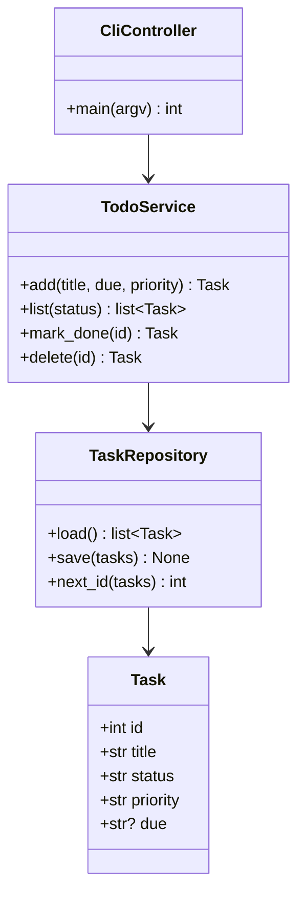
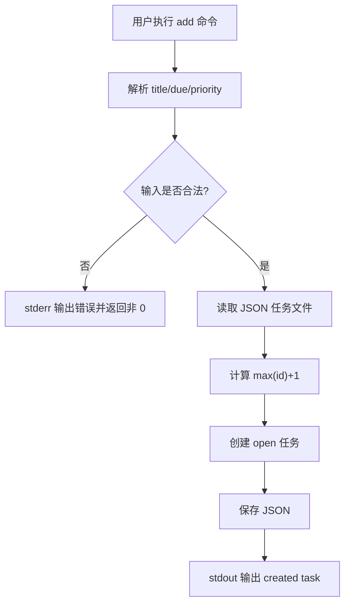
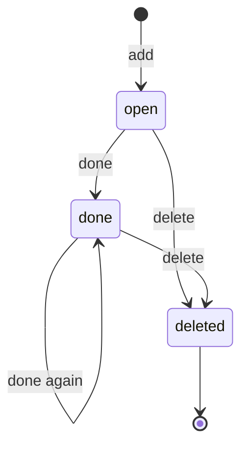

# 待办事项管理系统设计模型

## 1. 类图

## 2. 添加任务活动图

## 3. 状态机

## 4. 模块建议

Agent 可以自行决定文件结构，但推荐至少包含：

- `todo_manager/__main__.py`：命令行入口。
- `todo_manager/cli.py`：参数解析和输出。
- `todo_manager/core.py`：业务逻辑。
- `todo_manager/storage.py`：JSON 文件读写。
