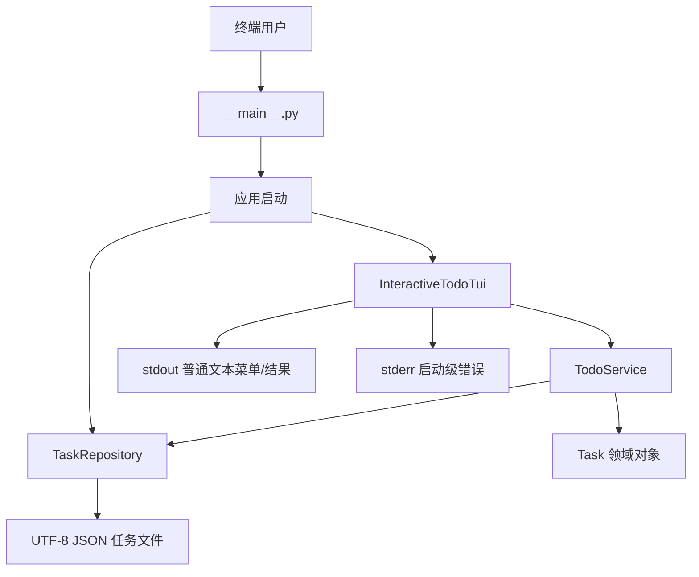
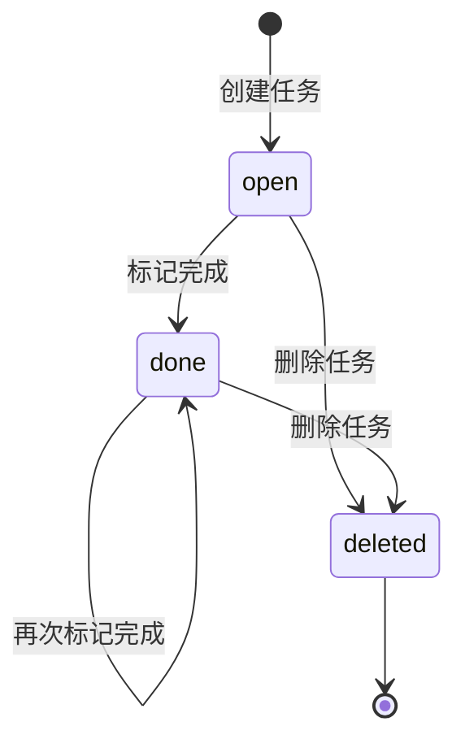
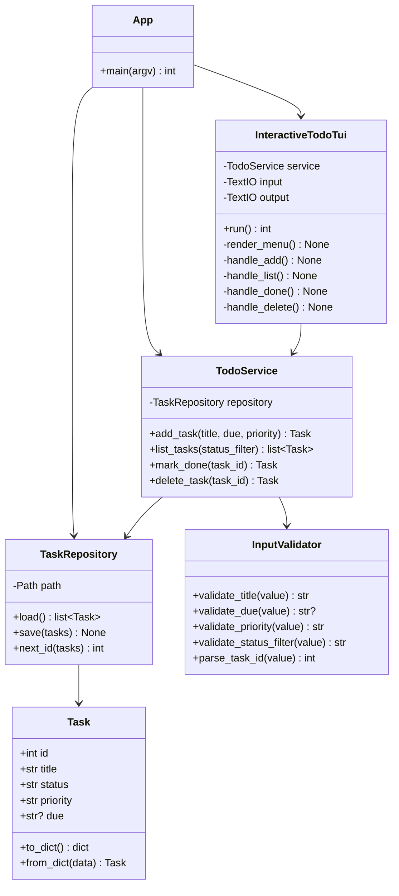
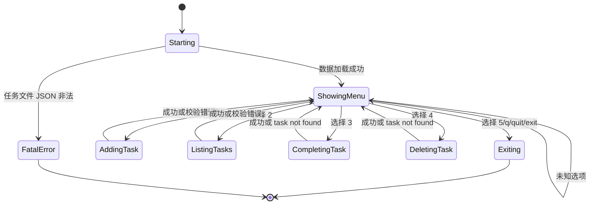
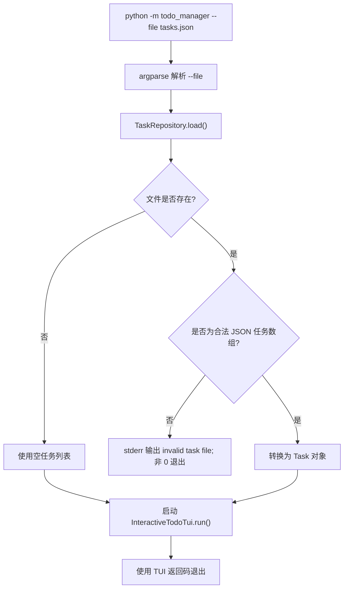
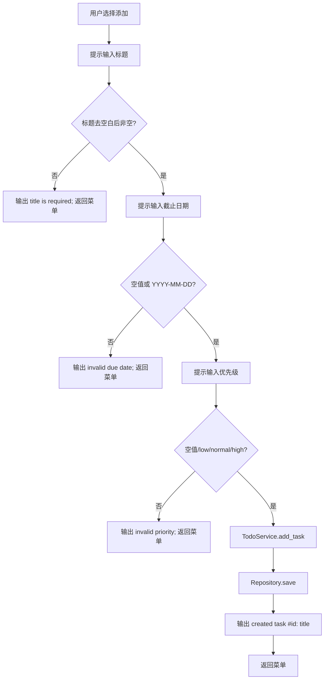
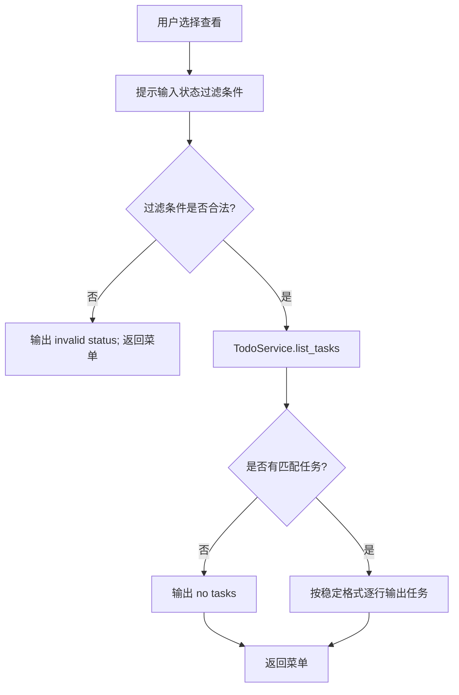
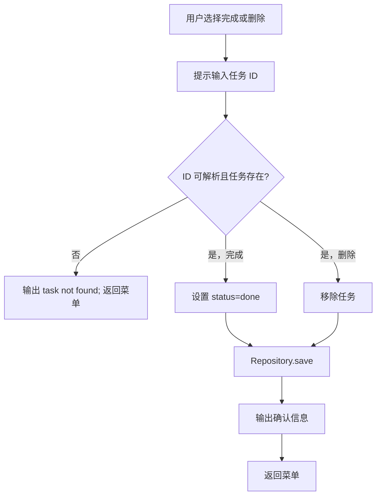
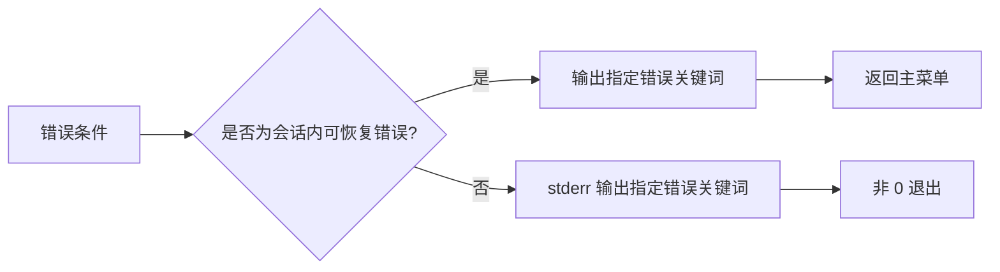

# 待办事项管理系统设计模型

## 1. 设计目标

待办事项管理系统应实现为一个小型分层 Python 应用。交互式文本 TUI 是主要产品界面，但 TUI 不应直接承担所有持久化和业务规则。清晰分层可以让系统更容易测试、调试和修复：

- UI 层负责显示菜单、读取用户输入、打印用户可见消息。
- 应用服务层负责校验操作、协调任务增删改查。
- 仓储层负责 JSON 文件读取和保存。
- 领域模型负责表示任务数据和任务状态。

实现时可以使用不同文件名，但这些职责应在代码中保持清晰。

## 2. 推荐包结构

```text
workspace/
└── todo_manager/
    ├── __init__.py
    ├── __main__.py        # python -m todo_manager 入口
    ├── app.py             # 启动装配和退出码处理
    ├── tui.py             # 交互式菜单循环和输入提示
    ├── service.py         # 任务业务操作和校验
    ├── storage.py         # JSON 读写
    └── models.py          # Task 数据类或等价领域对象
```

这是推荐结构，不是强制结构。若实现规模较小，也可以合并部分文件，但必须满足 PRD 中的行为要求。

## 3. 系统结构图



启动流程应先根据 `--file` 创建仓储对象，读取已有任务，然后进入 TUI 循环。若出现非法 JSON 等启动级错误，应在进入菜单前报告并退出。

## 4. 领域模型

### 4.1 Task

每个任务包含以下字段：

| 字段 | 类型 | 规则 |
| --- | --- | --- |
| `id` | int | 正整数，在当前任务文件内唯一 |
| `title` | str | 去除首尾空白后不能为空 |
| `status` | str | 只能是 `open` 或 `done` |
| `priority` | str | 只能是 `low`、`normal`、`high` |
| `due` | str 或 null | `YYYY-MM-DD` 或 null |

### 4.2 任务状态机



删除任务时不需要在 JSON 中保留 deleted 状态，直接从任务数组中移除即可。

## 5. 类图



UI 层可以捕获可恢复校验错误并输出错误信息；启动级致命错误应返回非 0 退出码。

## 6. TUI 会话状态图



TUI 菜单循环应是面向行输入的：

1. 打印菜单。
2. 读取一行输入。
3. 分发到一个动作。
4. 除退出或 EOF 外，回到菜单。

## 7. 启动流程



## 8. 添加任务流程



校验应发生在写文件前。添加失败时不得创建半成品任务。

## 9. 查看任务流程



查看操作不应修改 JSON 文件。

## 10. 完成和删除流程



完成和删除操作成功后都应立即保存。

## 11. 持久化设计

仓储层职责：

- 解析配置的数据文件路径。
- 文件不存在时返回空列表。
- 读取 UTF-8 文本并解析 JSON。
- 校验顶层 JSON 是任务对象数组。
- 将字典转换为 `Task` 对象。
- 使用两个空格缩进和 `ensure_ascii=False` 保存任务数组。

推荐实现细节：

- 使用 `json.loads` 和 `json.dumps`。
- 使用 `datetime.date.fromisoformat` 校验截止日期。
- 保存时先写入同目录临时文件，再用 `Path.replace` 替换目标文件。
- 输出和保存任务时按 ID 升序排序。

## 12. 错误处理模型



可恢复错误包括非法标题、日期、优先级、过滤条件、任务 ID 和未知菜单选项。致命错误包括启动时读取到非法 JSON 文件。

## 13. 可测试性要求

隐藏 oracle 会将程序作为 subprocess 启动，把生成的 `workspace` 加入 `PYTHONPATH`，通过 stdin 发送菜单选项，并检查 stdout、stderr 和 JSON 文件。因此：

- 不要依赖无法在 `subprocess.run(input=...)` 中工作的交互特性。
- EOF 后不要无限等待输入。
- 用户提示和结果应写入 stdout。
- 不需要外部依赖。
- 输出消息应稳定，便于断言。
