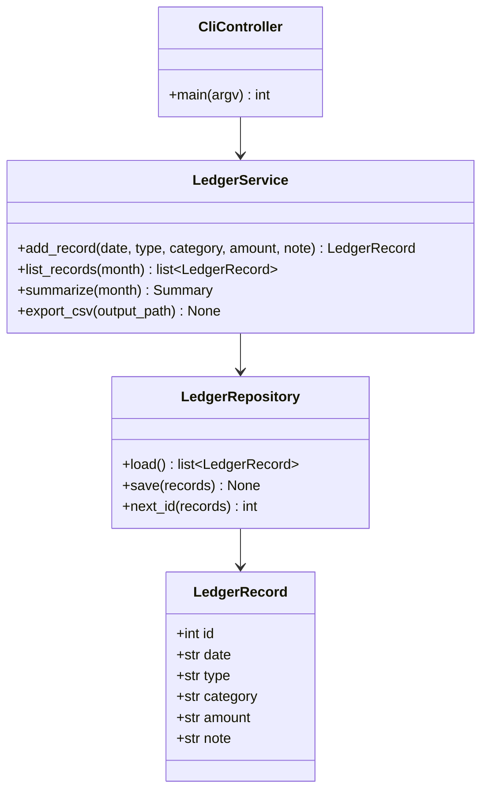
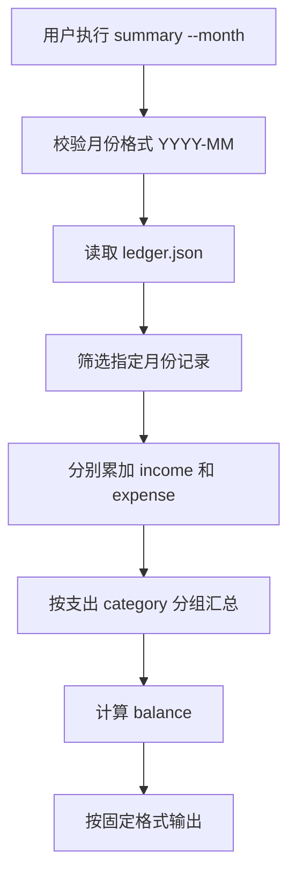
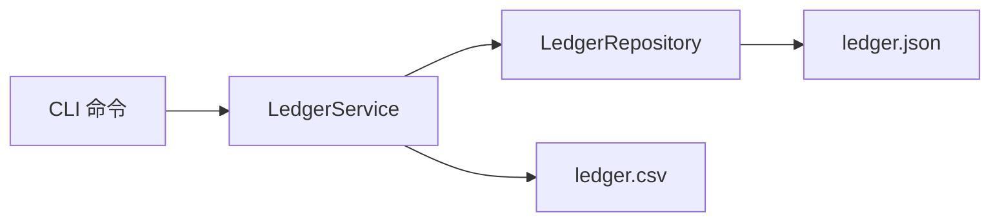

# 个人记账系统设计模型

## 1. 类图

## 2. 月度汇总流程

## 3. 数据流

## 4. 模块建议

- `personal_ledger/__main__.py`：命令行入口。
- `personal_ledger/cli.py`：参数解析。
- `personal_ledger/core.py`：业务逻辑和金额计算。
- `personal_ledger/storage.py`：JSON/CSV 文件处理。
