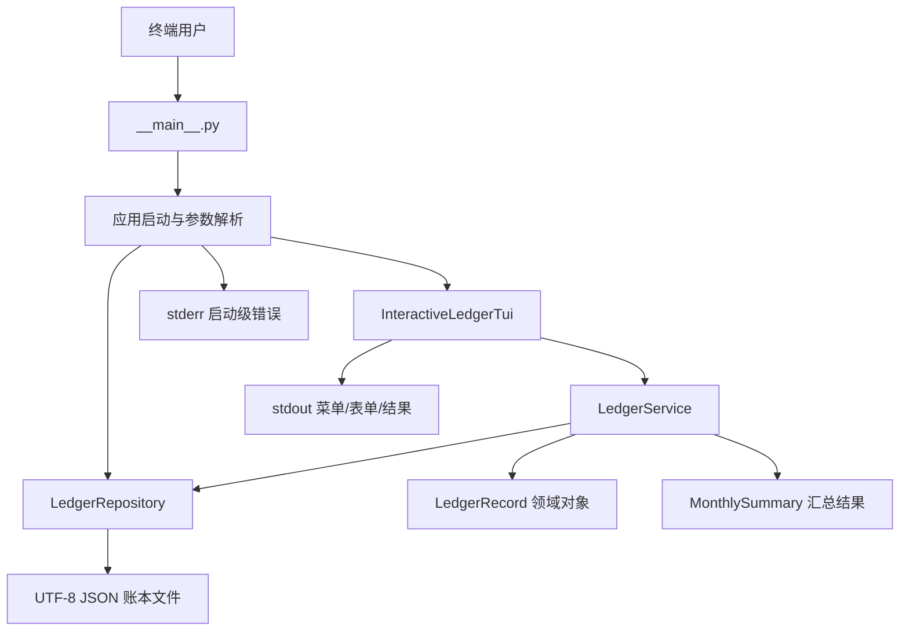
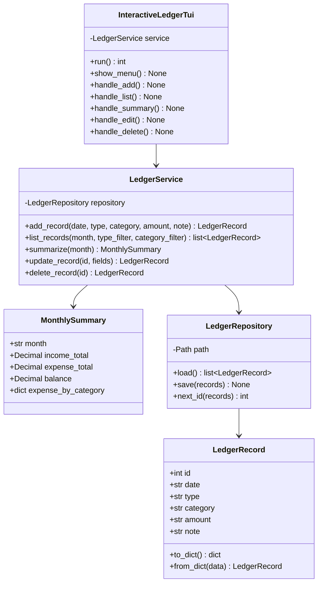
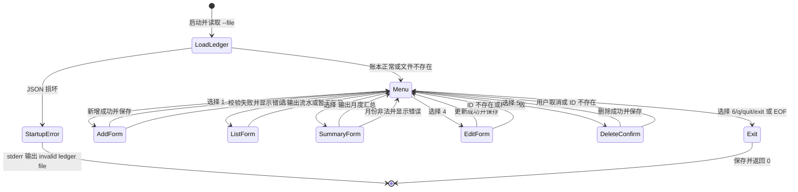
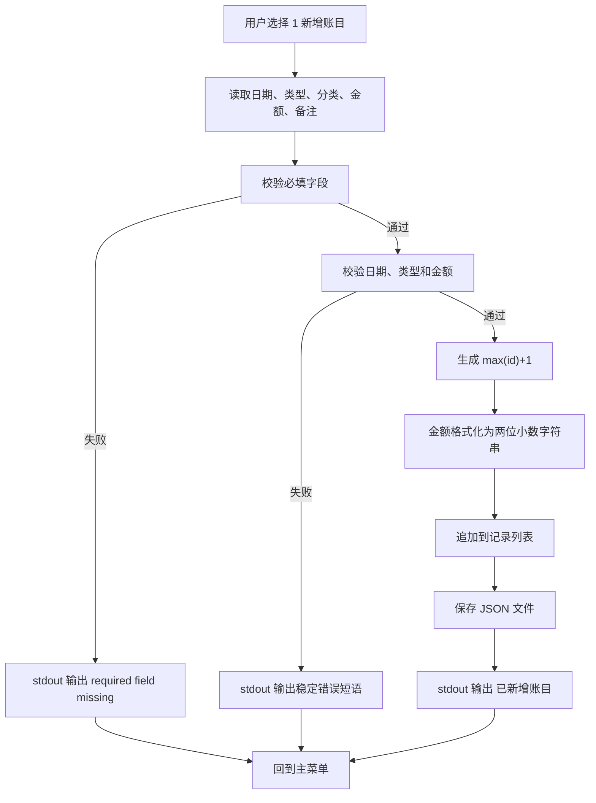
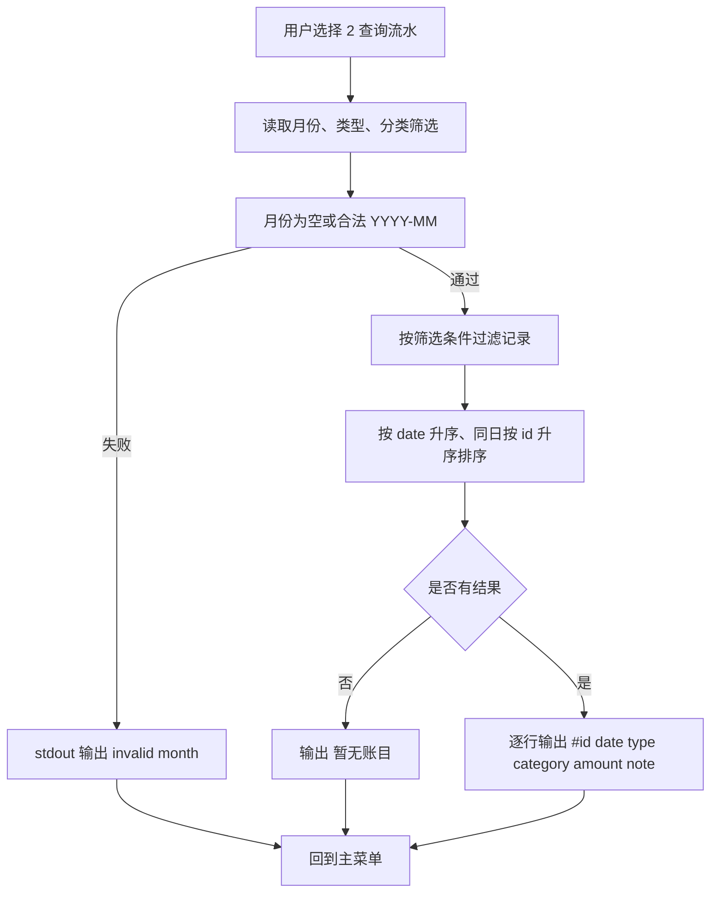
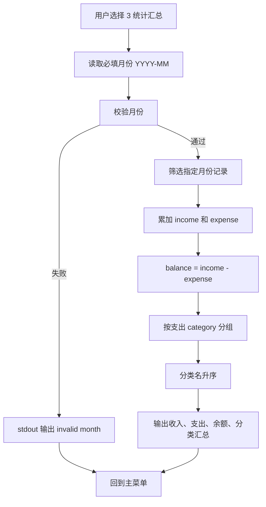
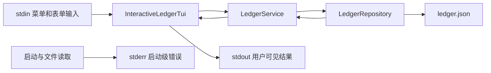

# 个人记账系统设计模型

## 1. 设计目标

个人记账系统应实现为一个小型分层 Python 应用。交互式文本 TUI 是主要产品界面，但 TUI 不应直接承担金额计算、数据校验和 JSON 持久化。清晰分层可以让系统更容易测试、调试和修复：

- UI 层负责显示菜单、读取表单输入、打印用户可见消息。
- 应用服务层负责新增、查询、统计、编辑、删除等业务操作。
- 仓储层负责 JSON 文件读取、保存和损坏文件识别。
- 领域模型负责表示账目记录、金额、类型和校验结果。

实现时可以使用不同文件名，但这些职责应在代码中保持清晰。默认入口必须启动交互式 TUI。

## 2. 推荐包结构

```text
workspace/
└── personal_ledger/
    ├── __init__.py
    ├── __main__.py        # python -m personal_ledger 入口
    ├── app.py             # 参数解析、启动装配、退出码处理
    ├── tui.py             # 菜单循环、表单提示、stdout 文本输出
    ├── service.py         # 记账业务逻辑、统计、编辑、删除
    ├── storage.py         # JSON 读取、保存、文件损坏处理
    └── models.py          # LedgerRecord、Summary 等领域对象
```

这是推荐结构，不是强制结构。若实现规模较小，也可以合并部分文件，但必须满足 PRD 中的行为要求。

## 3. 系统结构图



启动流程应先根据 `--file` 创建仓储对象并读取已有账目，再进入 TUI 循环。若 JSON 文件损坏，应在进入菜单前向 stderr 报告 `invalid ledger file` 并返回非 0。

## 4. 领域模型

### 4.1 LedgerRecord

每条账目记录包含以下字段：

| 字段 | 类型 | 规则 |
| --- | --- | --- |
| `id` | int | 正整数，在当前账本文件内唯一 |
| `date` | str | 合法日期，格式 `YYYY-MM-DD` |
| `type` | str | 只能是 `income` 或 `expense` |
| `category` | str | 去除首尾空白后不能为空 |
| `amount` | str | 大于 0 的两位小数字符串 |
| `note` | str | 可为空字符串 |

金额建议使用 `decimal.Decimal` 解析、量化和累加，避免二进制浮点误差。保存到 JSON 前应统一格式化为两位小数字符串。

### 4.2 MonthlySummary

月度汇总结果可以表示为：

| 字段 | 类型 | 说明 |
| --- | --- | --- |
| `month` | str | 统计月份，格式 `YYYY-MM` |
| `income_total` | Decimal | 当月收入合计 |
| `expense_total` | Decimal | 当月支出合计 |
| `balance` | Decimal | 收入合计减支出合计 |
| `expense_by_category` | dict[str, Decimal] | 支出分类汇总 |

分类汇总只统计 `expense` 记录，输出时按分类名升序排列。

## 5. 类图



## 6. TUI 状态流



## 7. 核心流程图

### 7.1 新增账目流程



### 7.2 查询流水流程



### 7.3 月度统计流程



## 8. 数据流



所有正常业务错误都回到 stdout，方便用户继续操作；只有账本文件损坏这类启动级错误写入 stderr 并终止。

## 9. 校验规则建议

- 日期校验：使用 `datetime.date.fromisoformat` 或等价方式，确保 `2026-02-30` 这类不存在的日期会失败。
- 月份校验：使用正则或手动校验 `YYYY-MM`，月份必须为 `01` 到 `12`，`2026-6` 不合法。
- 金额校验：使用 `Decimal`，要求大于 0，最终 `quantize(Decimal("0.01"))`。
- 类型校验：必须支持 `income` 和 `expense`。
- 必填字段校验：新增时日期、类型、分类、金额均不能为空；编辑时只校验用户实际填写的新值。
- ID 校验：编辑和删除应先确认 ID 存在，不存在时输出 `record not found`。

## 10. 文件格式和兼容性

JSON 文件应保持简单、可读、可排查：

```json
[
  {
    "id": 1,
    "date": "2026-06-01",
    "type": "income",
    "category": "salary",
    "amount": "5000.00",
    "note": "monthly salary"
  }
]
```

保存时建议使用稳定字段顺序：`id`、`date`、`type`、`category`、`amount`、`note`。读取时如果发现顶层不是数组、记录缺字段、字段类型明显错误或金额无法解析，应视为 `invalid ledger file`，不要覆盖原文件。
