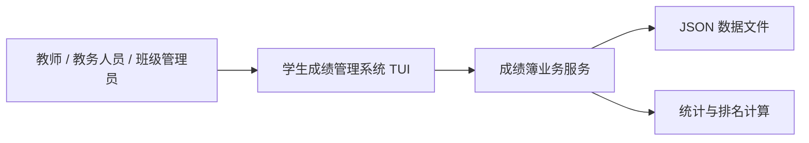
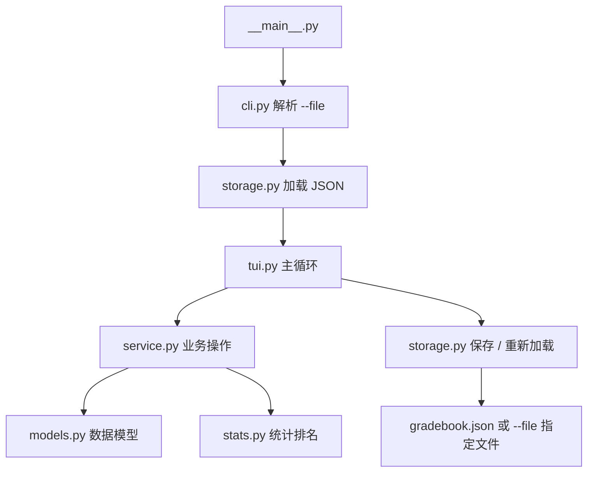
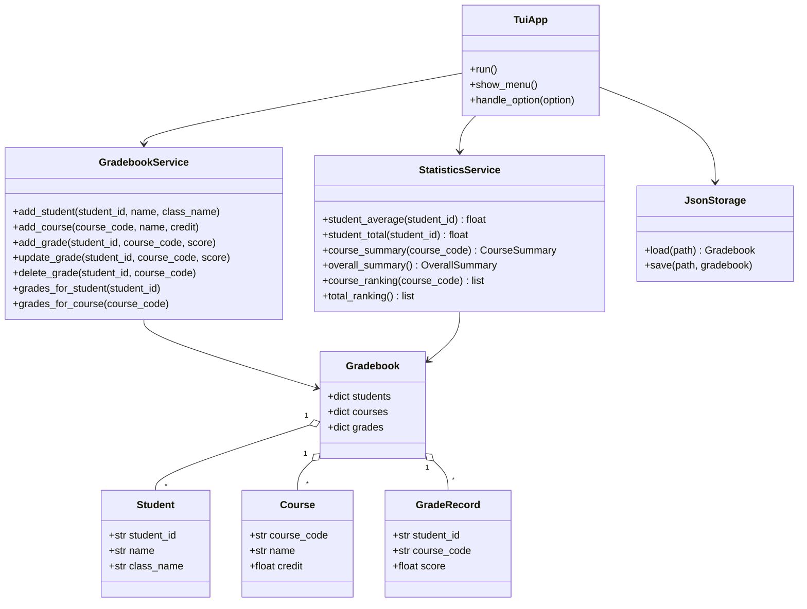
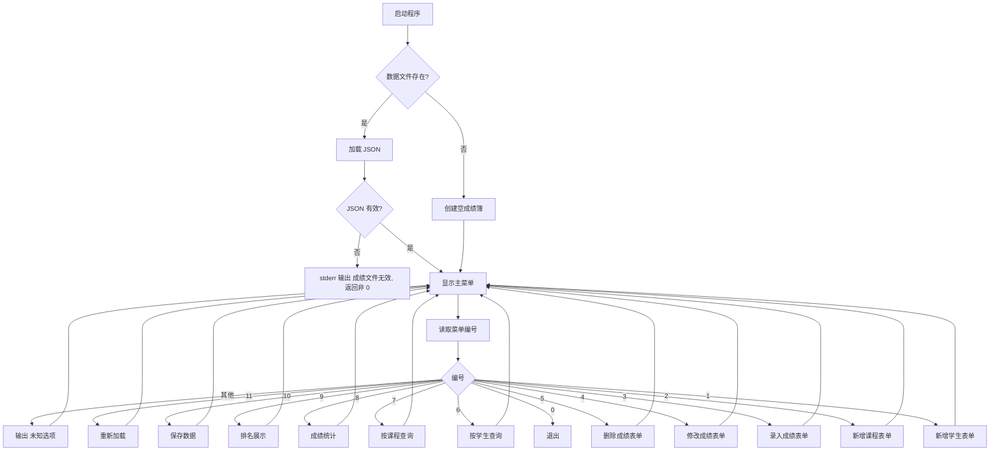
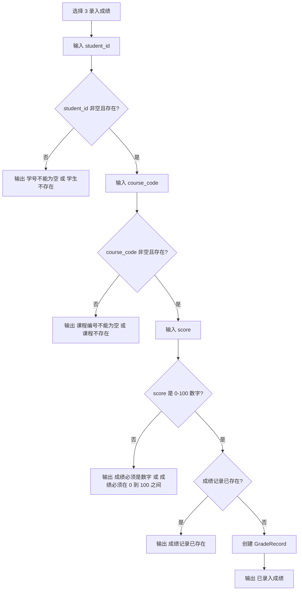
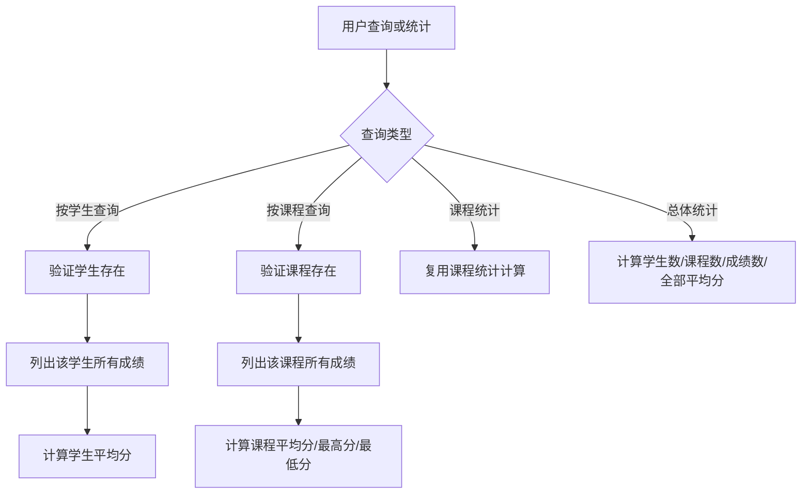
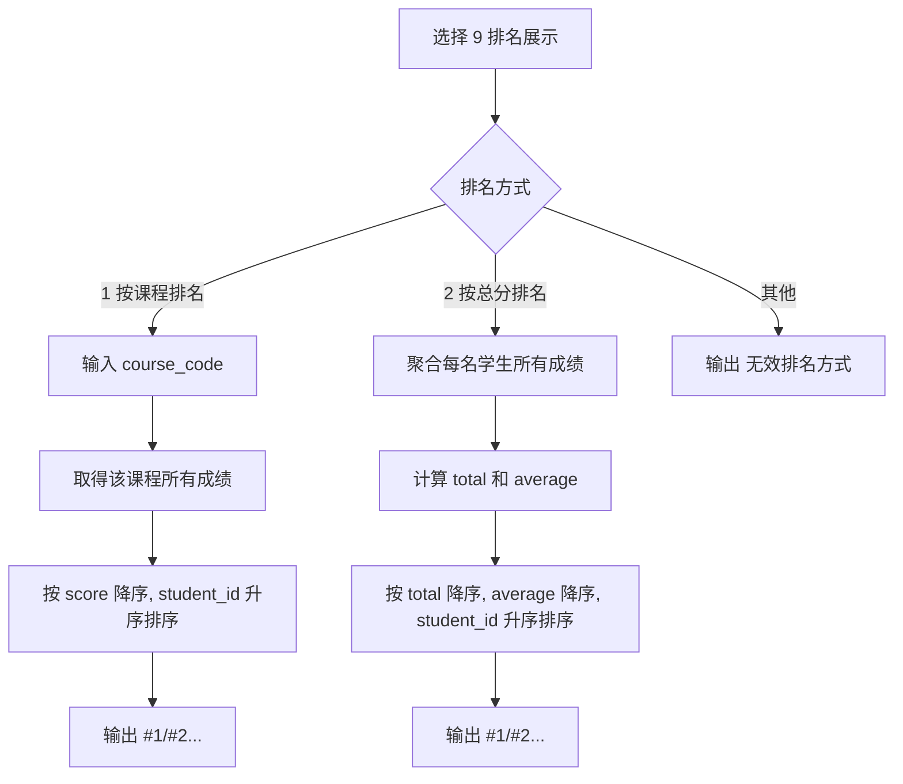
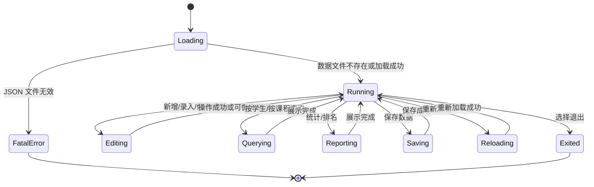

# 学生成绩管理系统设计模型

## 1. 设计目标

学生成绩管理系统应实现为一个本地 Python TUI 应用。设计重点不是复杂界面，而是清晰的数据模型、稳定的交互流程、可验证的业务规则和可靠的 JSON 持久化。

系统需要从空 `workspace/` 开始构建。推荐创建 `student_gradebook` Python 包，并通过 `python -m student_gradebook` 启动。

## 2. 系统上下文



说明：

- 用户只通过 TUI 操作系统。
- TUI 负责显示菜单、收集输入和展示结果。
- 业务服务负责学生、课程和成绩的增删改查。
- JSON 数据文件用于持久化。
- 统计与排名计算从当前内存数据中派生，不单独存储。

## 3. 推荐模块结构

```text
student_gradebook/
  __init__.py
  __main__.py
  cli.py
  models.py
  storage.py
  service.py
  stats.py
  tui.py
```

### 3.1 `__main__.py`

- 作为 `python -m student_gradebook` 的入口。
- 调用 `cli.py` 解析 `--file` 参数。
- 初始化存储和 TUI。
- 捕获启动阶段的致命错误，例如 JSON 文件损坏。

### 3.2 `cli.py`

- 使用 `argparse` 解析命令行参数。
- 参数：
  - `--file`：可选，指定 JSON 数据文件路径。
- 如果未指定 `--file`，默认使用当前工作目录下的 `gradebook.json`。

### 3.3 `models.py`

定义核心数据结构：

- `Student`
- `Course`
- `GradeRecord`
- `Gradebook`

可以使用 `dataclasses.dataclass`，也可以使用普通类和字典，但对外行为必须一致。

### 3.4 `storage.py`

负责 JSON 文件读写：

- 文件不存在时返回空成绩簿。
- 文件存在但 JSON 非法时抛出清晰异常。
- 保存时写出 `students`、`courses`、`grades` 三个顶层字段。
- 使用 UTF-8。

### 3.5 `service.py`

封装业务操作：

- 新增学生。
- 新增课程。
- 录入成绩。
- 修改成绩。
- 删除成绩。
- 按学生查询。
- 按课程查询。
- 校验重复编号、缺失字段和分数范围。

### 3.6 `stats.py`

封装派生计算：

- 学生平均分。
- 学生总分。
- 课程平均分。
- 课程最高分。
- 课程最低分。
- 课程排名。
- 总分排名。
- 总体统计。

### 3.7 `tui.py`

负责交互流程：

- 打印主菜单。
- 根据菜单编号调用对应处理函数。
- 收集表单字段。
- 捕获可恢复的输入错误并显示中文提示。
- 每次操作结束后回到主菜单。

## 4. 数据模型

### 4.1 Student

```text
Student
- student_id: str
- name: str
- class_name: str
```

规则：

- `student_id` 非空，唯一。
- `name` 非空。
- `class_name` 可为空字符串。

### 4.2 Course

```text
Course
- course_code: str
- name: str
- credit: float
```

规则：

- `course_code` 非空，唯一。
- `name` 非空。
- `credit` 非负；空输入时为 `0.0`。

### 4.3 GradeRecord

```text
GradeRecord
- student_id: str
- course_code: str
- score: float
```

规则：

- `(student_id, course_code)` 是成绩记录唯一键。
- `student_id` 必须引用已存在学生。
- `course_code` 必须引用已存在课程。
- `score` 必须在 0 到 100 之间。

### 4.4 Gradebook

```text
Gradebook
- students: dict[str, Student]
- courses: dict[str, Course]
- grades: dict[tuple[str, str], GradeRecord]
```

可以在内存中使用字典提升查询效率，保存 JSON 时转换为列表。

## 5. JSON 存储模型

JSON 文件必须使用以下结构：

```json
{
  "students": [
    {
      "student_id": "S001",
      "name": "Ada",
      "class_name": "Class 1"
    }
  ],
  "courses": [
    {
      "course_code": "CS101",
      "name": "Python",
      "credit": 3.0
    }
  ],
  "grades": [
    {
      "student_id": "S001",
      "course_code": "CS101",
      "score": 95.0
    }
  ]
}
```

加载时应重新校验文件中的基本结构。如果 JSON 无法解析，启动阶段应输出 `成绩文件无效` 并返回非 0。

## 6. 系统结构图



## 7. 类图



## 8. 主菜单流程图



## 9. 成绩录入流程图



## 10. 查询和统计流程图



## 11. 排名流程图



## 12. 状态转移图



## 13. 校验规则

### 13.1 文本字段

- 输入后先执行 `strip()`。
- 必填字段为空时直接报错。
- 保存时使用清理后的值。

### 13.2 分数

- 空字符串无效。
- 不能解析为数字时输出 `成绩必须是数字`。
- 小于 0 或大于 100 时输出 `成绩必须在 0 到 100 之间`。
- 展示时保留两位小数。

### 13.3 学分

- 空字符串按 `0.0` 处理。
- 不能解析为数字时输出 `学分必须是数字`。
- 小于 0 时输出 `学分必须是数字`。

### 13.4 唯一性

- 学号唯一。
- 课程编号唯一。
- 成绩记录按 `(student_id, course_code)` 唯一。

## 14. 统计计算规则

### 14.1 学生平均分

```text
average = sum(student_scores) / len(student_scores)
```

如果学生没有成绩，则不计算平均分，输出 `暂无成绩`。

### 14.2 学生总分

```text
total = sum(student_scores)
```

总分排名只纳入至少有一条成绩的学生。

### 14.3 课程统计

```text
course_average = sum(course_scores) / len(course_scores)
course_highest = max(course_scores)
course_lowest = min(course_scores)
```

并列时按学号升序选择最高分或最低分代表学生。

### 14.4 总体统计

```text
overall_average = sum(all_scores) / len(all_scores)
```

没有成绩时，整体平均分显示为 `0.00`，并可额外输出 `暂无成绩`。

## 15. 推荐输出格式

为便于人工阅读和自动化验证，关键输出应包含以下固定短语：

- 标题：`学生成绩管理系统`
- 新增学生成功：`已新增学生 <student_id> <name>`
- 新增课程成功：`已新增课程 <course_code> <name>`
- 录入成绩成功：`已录入成绩 <student_id> <course_code> <score>`
- 修改成绩成功：`已修改成绩 <student_id> <course_code> <score>`
- 删除成绩成功：`已删除成绩 <student_id> <course_code>`
- 学生平均分：`学生平均分: <average>`
- 课程平均分：`课程平均分: <average>`
- 最高分：`最高分: <student_id> <name> <score>`
- 最低分：`最低分: <student_id> <name> <score>`
- 保存成功：`保存成功`
- 重新加载成功：`重新加载成功`

系统可以在这些固定短语前后添加额外说明，但不能缺少这些核心内容。
