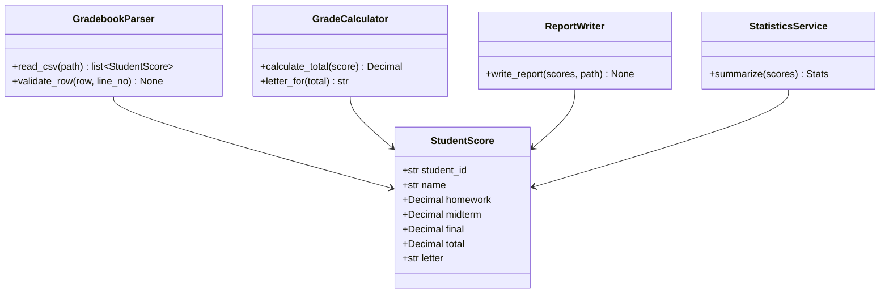
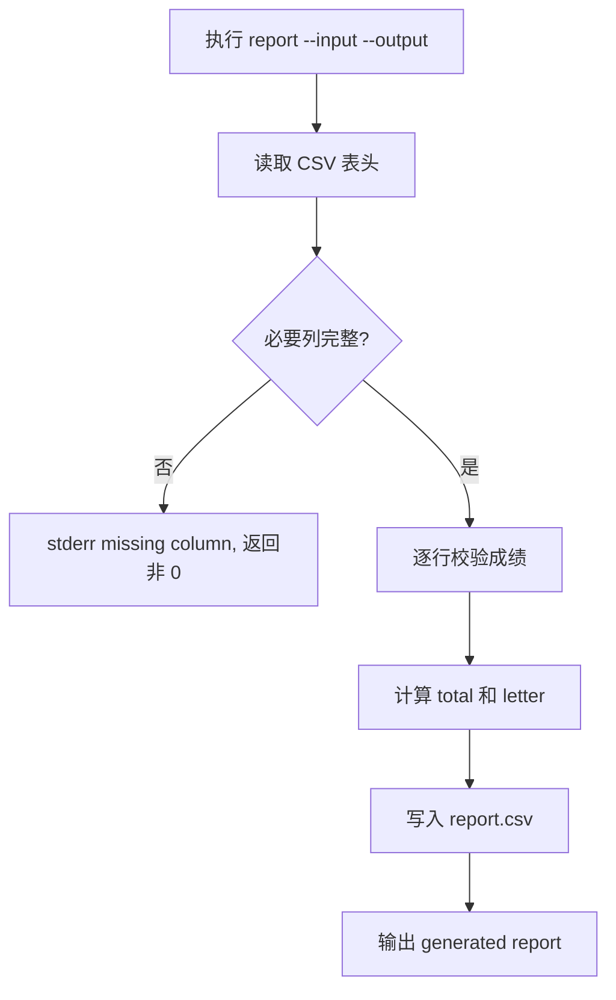
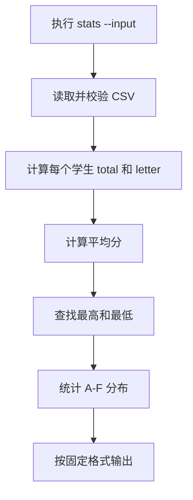

# 学生成绩管理系统设计模型

## 1. 类图

## 2. report 命令活动图

## 3. stats 命令活动图

## 4. 模块建议

- `student_gradebook/__main__.py`：CLI 入口。
- `student_gradebook/cli.py`：命令行解析。
- `student_gradebook/core.py`：成绩计算和统计。
- `student_gradebook/csv_io.py`：CSV 读取与写入。
