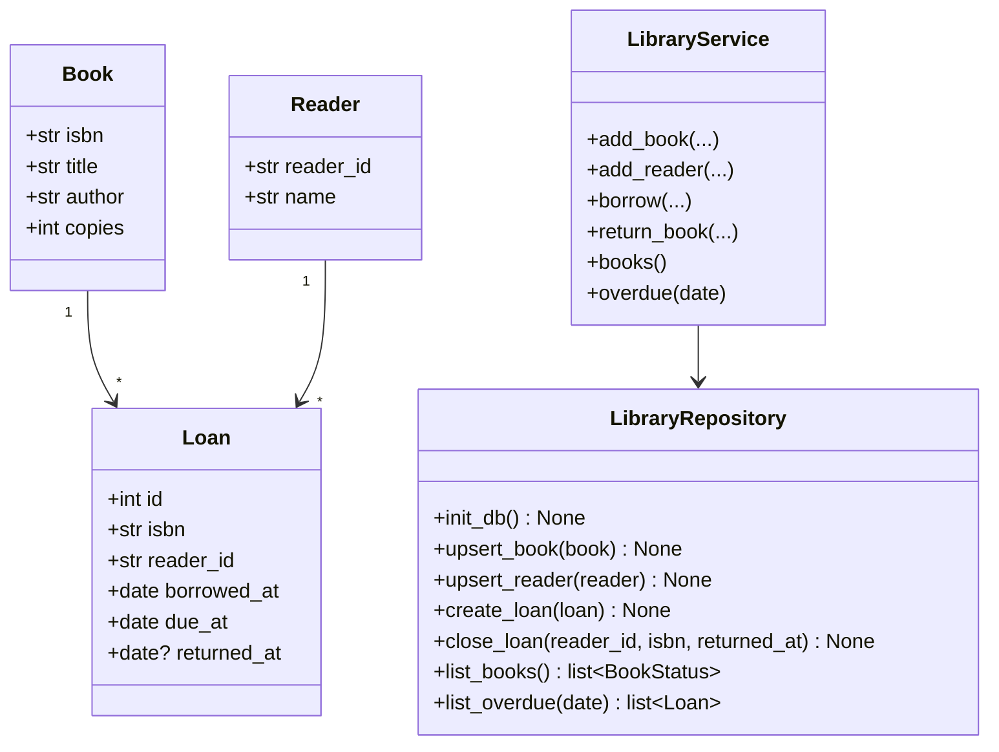
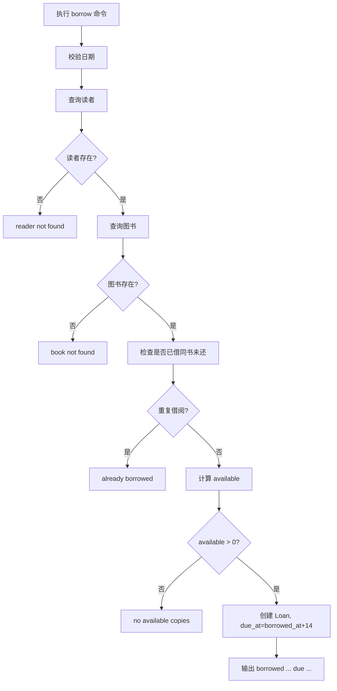
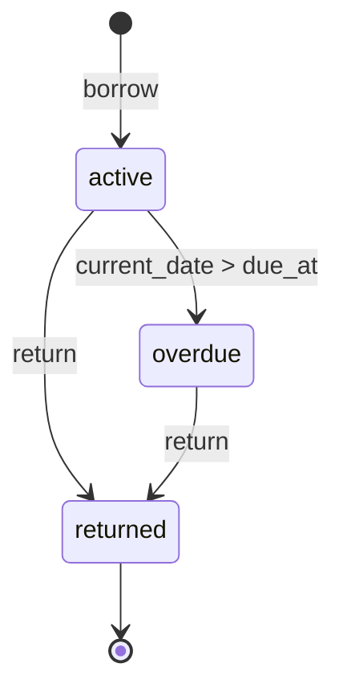

# 图书借阅管理系统设计模型

## 1. 类图

## 2. 借书流程

## 3. 借阅状态机

## 4. 模块建议

- `library_lending/__main__.py`：CLI 入口。
- `library_lending/cli.py`：命令行解析和输出。
- `library_lending/service.py`：业务规则。
- `library_lending/repository.py`：SQLite 访问。
