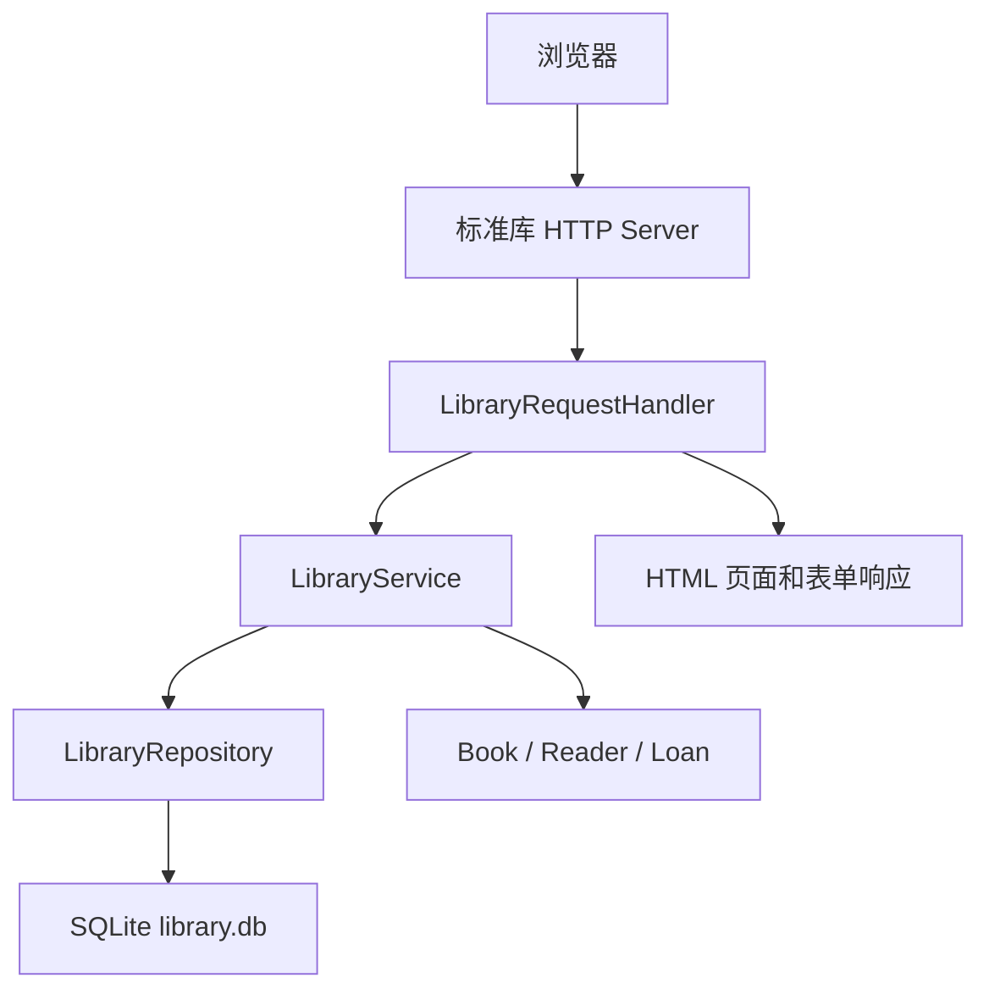
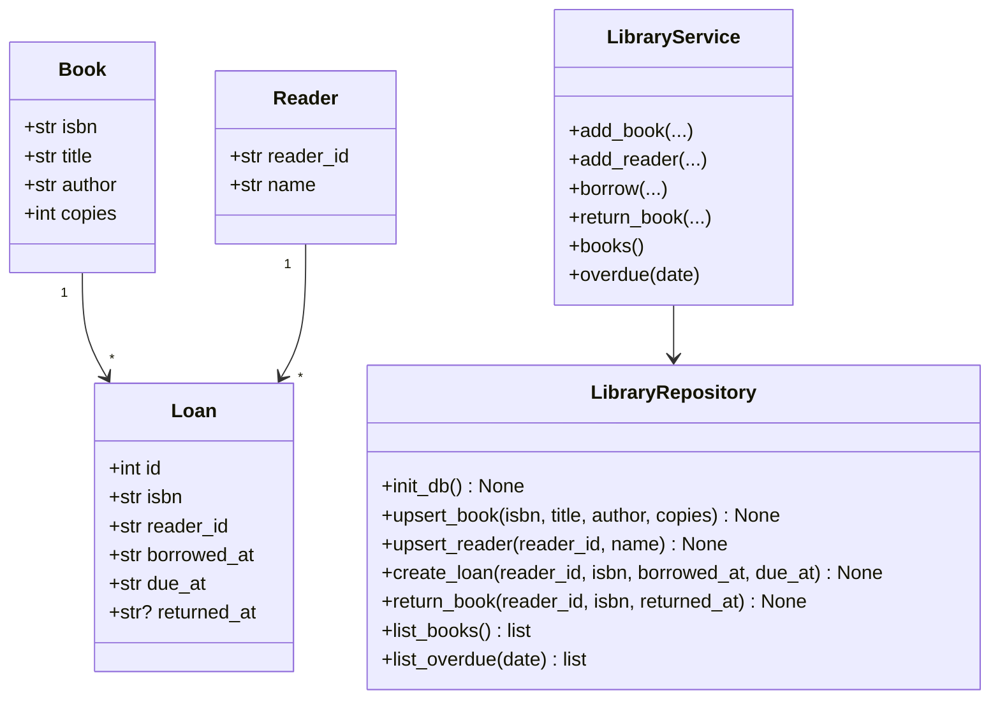
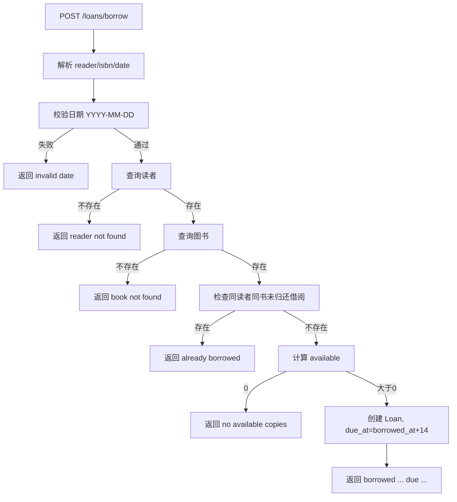
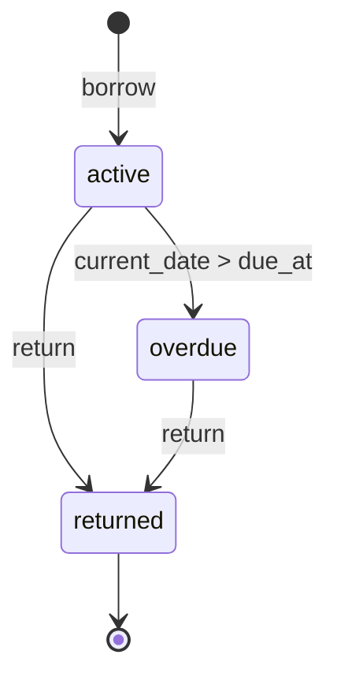

# 图书借阅管理系统设计模型

## 1. 设计目标

图书借阅管理系统应实现为一个小型标准库 Web 应用。浏览器页面是主要用户界面，但 Web handler 不应直接承担全部业务规则和 SQL 细节。推荐分层：

- Web 层：基于 `http.server` 处理 GET/POST、解析表单、渲染 HTML。
- 服务层：处理图书入库、读者注册、借书、还书、库存和逾期业务规则。
- 仓储层：使用 `sqlite3` 初始化表并读写数据。
- 领域模型：表示 Book、Reader、Loan 和库存状态。

项目不得依赖 Flask、FastAPI、Django 或其它第三方包。

## 2. 推荐包结构

```text
workspace/
└── library_lending/
    ├── __init__.py        # 暴露 create_server
    ├── __main__.py        # python -m library_lending 入口
    ├── server.py          # http.server handler 和 create_server
    ├── service.py         # 借阅业务规则
    ├── repository.py      # SQLite 初始化和查询
    ├── models.py          # 领域对象或轻量数据结构
    └── templates.py       # 简单 HTML 渲染函数，可与 server.py 合并
```

这是推荐结构，不是强制结构。实现可以更简单，但必须提供 `create_server(db_path, host="127.0.0.1", port=0)`，并支持 `python -m library_lending --db ... --host ... --port ...` 启动。

## 3. 系统结构图



## 4. 路由设计

| 方法 | 路径 | 用途 |
| --- | --- | --- |
| GET | `/` | 首页，展示导航和主要表单 |
| GET | `/books` | 库存列表 |
| POST | `/books` | 添加或更新图书 |
| POST | `/readers` | 注册或更新读者 |
| POST | `/loans/borrow` | 办理借书 |
| POST | `/loans/return` | 办理还书 |
| GET | `/overdue?date=YYYY-MM-DD` | 查询逾期借阅 |

POST 可以直接返回结果页，也可以返回包含结果提示的 HTML 页面。响应正文必须包含 PRD 中定义的稳定成功或错误短语。

## 5. 数据模型



## 6. SQLite 表建议

```sql
CREATE TABLE IF NOT EXISTS books (
  isbn TEXT PRIMARY KEY,
  title TEXT NOT NULL,
  author TEXT NOT NULL,
  copies INTEGER NOT NULL
);

CREATE TABLE IF NOT EXISTS readers (
  reader_id TEXT PRIMARY KEY,
  name TEXT NOT NULL
);

CREATE TABLE IF NOT EXISTS loans (
  id INTEGER PRIMARY KEY AUTOINCREMENT,
  isbn TEXT NOT NULL,
  reader_id TEXT NOT NULL,
  borrowed_at TEXT NOT NULL,
  due_at TEXT NOT NULL,
  returned_at TEXT,
  FOREIGN KEY(isbn) REFERENCES books(isbn),
  FOREIGN KEY(reader_id) REFERENCES readers(reader_id)
);
```

可借数量计算：

```text
available = books.copies - count(loans where isbn = book.isbn and returned_at is null)
```

## 7. 借书流程



## 8. 借阅状态机



`overdue` 不需要写入数据库，是查询时根据当前日期和 `due_at` 动态判断的展示状态。

## 9. HTTP 和 HTML 处理建议

- 使用 `urllib.parse.parse_qs` 解析表单。
- 使用 `html.escape` 输出用户输入，避免 HTML 注入。
- 成功和错误都返回 UTF-8 HTML。
- 正常页面设置 `Content-Type: text/html; charset=utf-8`。
- 表单错误响应状态码可使用 400、404 或 409，正文必须包含稳定错误短语。
- 页面无需复杂样式，但应有清晰标题、表单标签和导航链接，方便浏览器演示。
