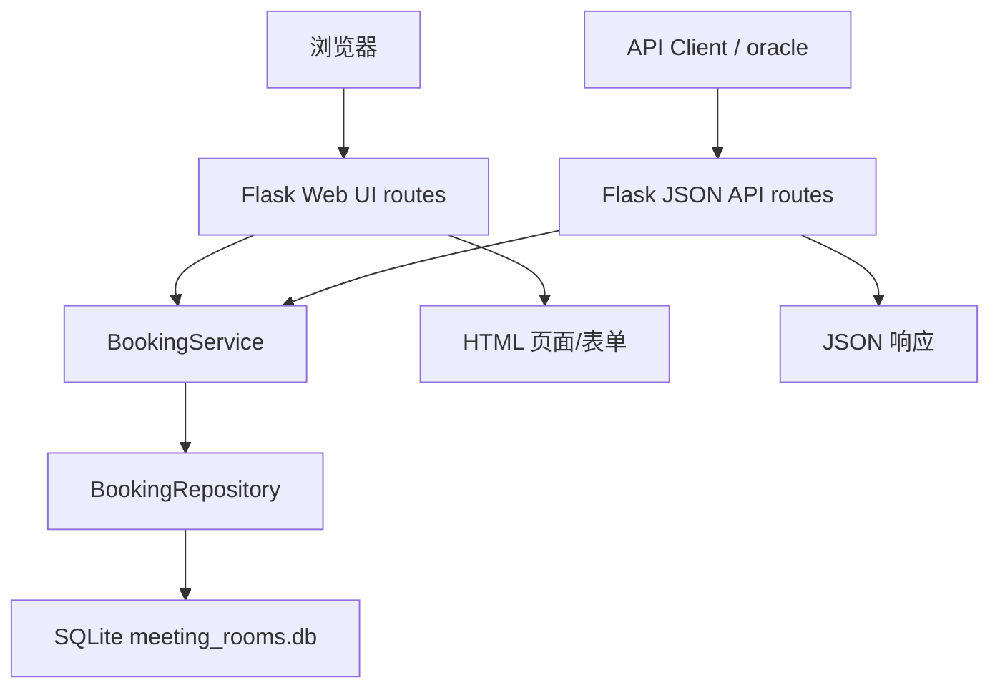
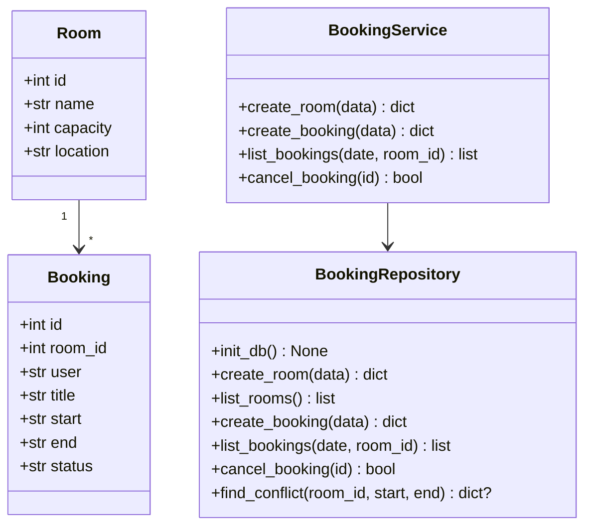
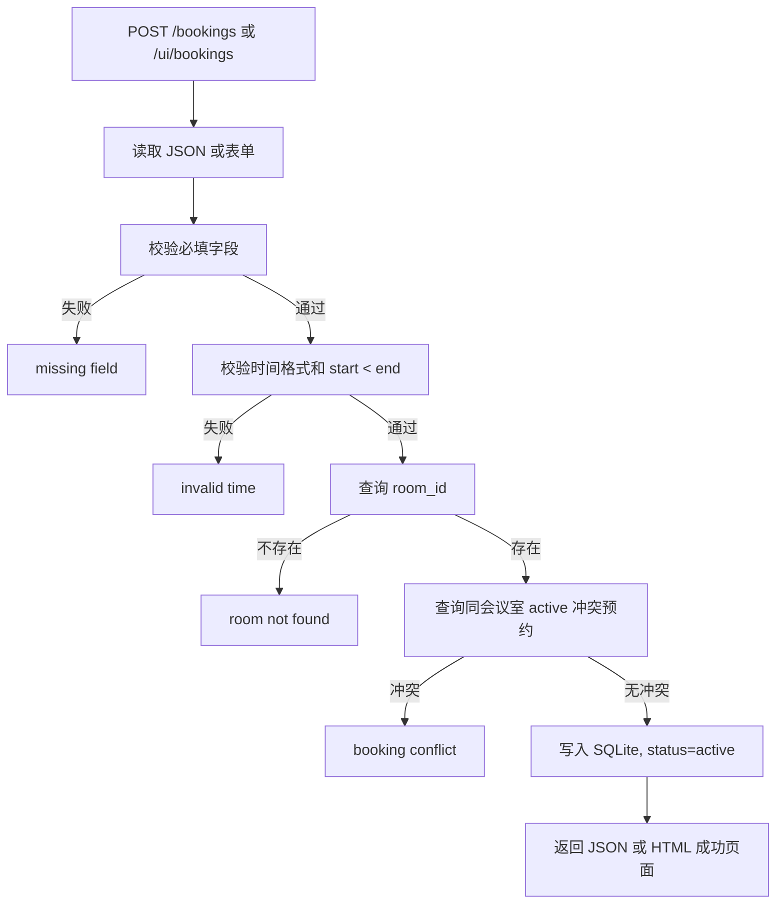
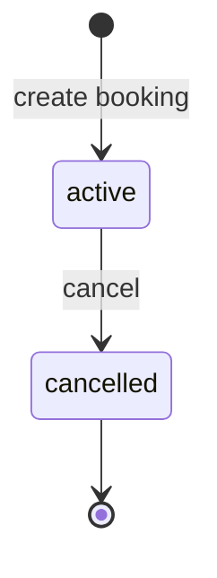

# 会议室预约系统设计模型

## 1. 设计目标

会议室预约系统应实现为一个小型 Flask 应用，同时服务浏览器 Web UI 和 JSON API。推荐分层：

- Flask app factory：创建应用、注入数据库路径、注册路由。
- Web/API routes：处理 HTML 表单、JSON 请求和响应。
- Service：处理校验、冲突检测、取消预约等业务规则。
- Repository：使用 SQLite 初始化表并读写数据。
- Templates：可以使用 Jinja 模板，也可以使用简单内联 HTML 渲染。

实现必须暴露 `create_app(db_path=None)`。`db_path=None` 时默认使用当前工作目录下的 `meeting_rooms.db`。

## 2. 推荐包结构

```text
workspace/
├── requirements.txt
└── meeting_room_booking/
    ├── __init__.py        # 导出 create_app
    ├── __main__.py        # python -m meeting_room_booking 启动 Web 服务
    ├── app.py             # create_app、Flask 路由注册
    ├── service.py         # 业务规则和校验
    ├── repository.py      # SQLite 访问
    ├── models.py          # Room、Booking 或轻量 dict 转换
    └── templates/         # 可选，HTML 页面
```

`requirements.txt` 应包含：

```text
Flask>=3.0,<4.0
```

## 3. 系统结构图



## 4. 路由设计

### Web UI

| 方法 | 路径 | 用途 |
| --- | --- | --- |
| GET | `/` | 首页，包含 `会议室预约系统` |
| GET | `/ui/rooms` | 会议室列表和创建表单 |
| POST | `/ui/rooms` | 表单创建会议室 |
| GET | `/ui/bookings` | 预约列表和创建表单，可按日期/会议室筛选 |
| POST | `/ui/bookings` | 表单创建预约 |
| POST | `/ui/bookings/<id>/cancel` | 表单取消预约 |

### JSON API

| 方法 | 路径 | 用途 |
| --- | --- | --- |
| GET | `/health` | 健康检查 |
| GET | `/rooms` | 查询会议室 |
| POST | `/rooms` | 创建会议室 |
| GET | `/bookings` | 查询 active 预约 |
| POST | `/bookings` | 创建预约 |
| DELETE | `/bookings/<id>` | 取消预约 |

Web UI 和 JSON API 可以复用同一套 service/repository，不应复制两套业务规则。

## 5. 数据模型



## 6. SQLite 表建议

```sql
CREATE TABLE IF NOT EXISTS rooms (
  id INTEGER PRIMARY KEY AUTOINCREMENT,
  name TEXT NOT NULL UNIQUE,
  capacity INTEGER NOT NULL,
  location TEXT NOT NULL DEFAULT ''
);

CREATE TABLE IF NOT EXISTS bookings (
  id INTEGER PRIMARY KEY AUTOINCREMENT,
  room_id INTEGER NOT NULL,
  user TEXT NOT NULL,
  title TEXT NOT NULL,
  start TEXT NOT NULL,
  end TEXT NOT NULL,
  status TEXT NOT NULL,
  FOREIGN KEY(room_id) REFERENCES rooms(id)
);
```

每次数据库操作后必须关闭连接，建议使用 `try/finally` 或 `contextlib.closing(sqlite3.connect(...))`。

## 7. 创建预约流程



## 8. 预约状态机



只有 `active` 预约参与冲突检测和查询结果。`cancelled` 记录可以保留在数据库中，但不应出现在普通查询列表里。

## 9. 响应约定

- JSON API 成功返回 JSON，错误返回 `{"error": "<message>"}`。
- Web UI 成功返回 HTML 页面，页面正文包含关键业务文本。
- Web UI 错误返回 HTML 错误页或带错误提示的页面，正文包含稳定错误短语。
- 不向用户泄漏 Python traceback。
