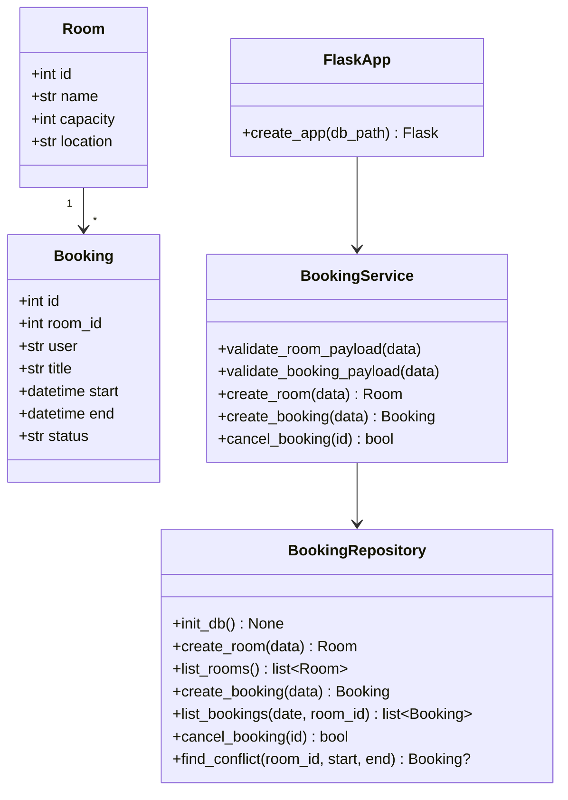
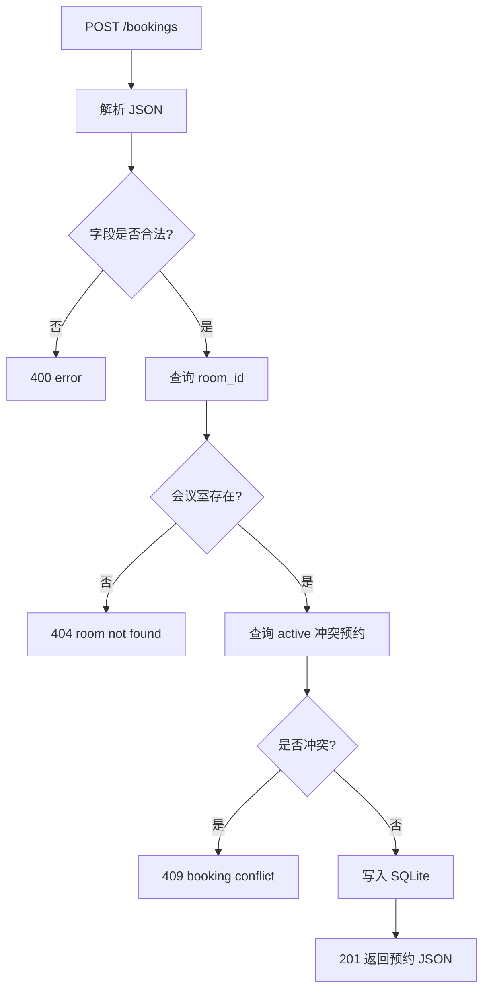
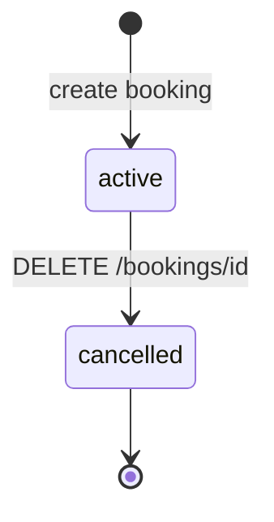
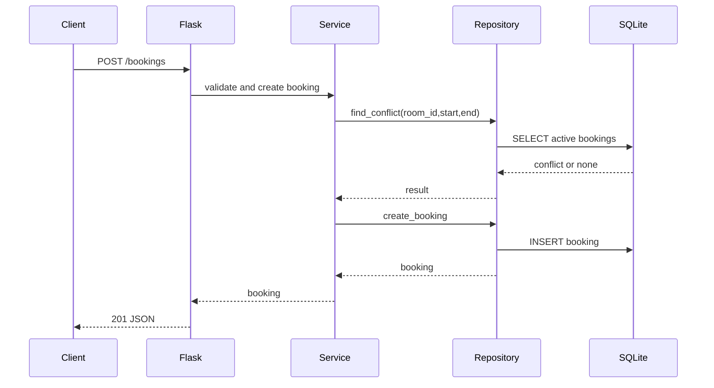

# 会议室预约系统设计模型

## 1. 类图

## 2. 创建预约流程

## 3. 预约状态机

## 4. API 时序图

## 5. 模块建议

- `meeting_room_booking/__init__.py`：导出 `create_app`。
- `meeting_room_booking/app.py`：Flask 路由。
- `meeting_room_booking/service.py`：校验和业务规则。
- `meeting_room_booking/repository.py`：SQLite 访问。
