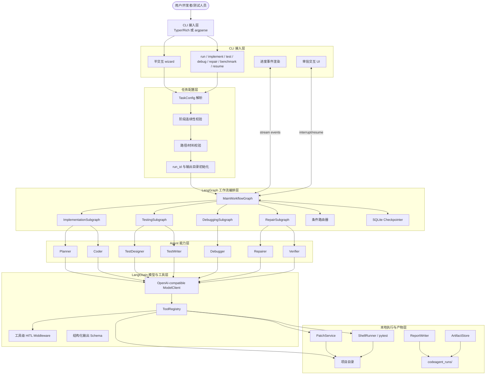
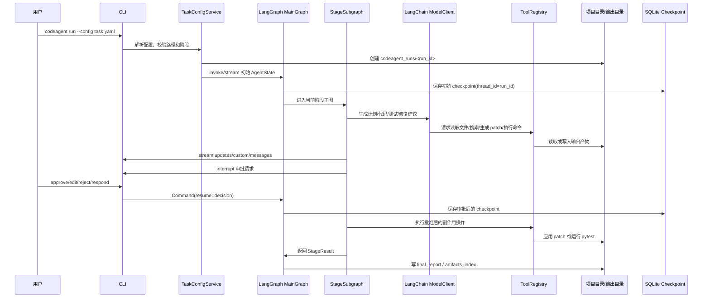
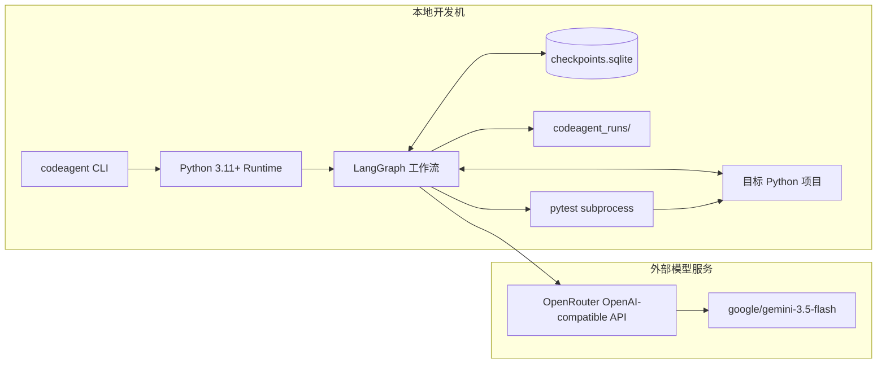

# 01 系统架构设计

## 1. 架构风格

系统采用“CLI 前端 + LangGraph 工作流运行时 + LangChain 模型/工具层 + 本地文件系统产物层”的分层架构。核心架构目标是：

1. 让用户通过 CLI 选择任务阶段并参与关键审批；
2. 用 LangGraph 显式编排实现、测试、调试、修复四阶段；
3. 用 LangChain 统一模型调用、工具调用和工具级 HITL；
4. 用 patch-first 和 SQLite checkpoint 保证可审计、可恢复；
5. 用输出目录保存所有报告、日志、补丁和可复现配置。

## 2. 系统分层架构图

## 3. 运行时视图

一次完整任务运行时，系统内部对象关系如下：

## 4. 部署视图

本课程原型采用单机本地运行部署，不设计服务端多用户系统。

## 5. 架构层职责

| 层 | 核心职责 | 不负责 |
|---|---|---|
| CLI 接入层 | 用户交互、参数采集、审批展示、进度渲染 | 业务推理、直接修改项目文件 |
| 任务配置层 | 解析配置、路径校验、阶段顺序校验、初始化输出目录 | 调用 LLM、执行测试 |
| 工作流编排层 | LangGraph 节点、条件边、checkpoint、interrupt、阶段路由 | 具体文件读写实现、报告模板细节 |
| Agent 能力层 | 生成计划、测试方案、根因分析、修复方案、结构化输出 | 直接越权执行 shell 或写源码 |
| 工具执行层 | 文件、搜索、patch、shell、pytest 解析、报告写入 | 自主决定业务路由 |
| 产物与状态层 | 状态保存、日志保存、报告和 artifact index | 重新生成模型内容 |

## 6. 框架边界

### 6.1 LangGraph 负责

- `StateGraph`、节点、边、条件路由；
- 阶段子图组合；
- checkpoint 和 thread_id 关联；
- `interrupt()` / `Command(resume=...)`；
- stream event 输出；
- 节点级 retry、timeout、error handler。

### 6.2 LangChain 负责

- ChatModel 统一接口；
- OpenAI-compatible 模型调用；
- tool 定义和工具调用协议；
- HumanInTheLoopMiddleware 作为工具级兜底；
- 结构化输出 schema 支持。

### 6.3 项目自主实现

- 四阶段子图节点设计；
- 阶段路由策略；
- CLI wizard 和审批交互；
- 文件扫描、上下文摘要、敏感文件跳过；
- patch 生成、审批、应用和变更清单；
- pytest 执行、日志保存、结果解析；
- 调试定位和修复闭环；
- metadata、transcript、decision_trace、报告和 benchmark 汇总。

## 7. 关键架构决策说明

| 决策 | 方案 | 理由 |
|---|---|---|
| 工作流结构 | 主图 + 阶段子图 | 便于分阶段 Mermaid 展示，也便于单阶段执行和完整流水线复用 |
| Agent 形式 | 角色节点，不做复杂多 Agent 团队 | 课程原型更需要可控、可解释、可复现；复杂对话团队不利于调试 |
| 文件修改 | patch-first | 符合人工审批要求，便于审计和回滚 |
| checkpoint | SQLite | 适合本地课程原型，支持中断恢复和 HITL |
| 模型接入 | OpenAI-compatible | 不绑定 OpenRouter SDK，便于替换 base_url/model_name/api_key_env |
| 语言范围 | Python + pytest | 降低日志解析、测试生成和修复验证复杂度 |
| Git | 不依赖 | 用户明确不考虑 Git 工作区检查；使用内部 diff/patch 产物替代 |
| IDE | 不设计 | 当前项目范围只覆盖 CLI；课程 IDE 要求在最终文档中说明范围偏差 |

## 8. 架构风险与缓解

| 风险 | 缓解设计 |
|---|---|
| LLM 生成无关大规模修改 | patch-first、变更范围检查、最小 diff 提示、人工审批 |
| 模型工具调用失控 | 工具级 HITL、工具调用次数限制、只读工具和有副作用工具分离 |
| 长日志导致上下文过载 | 日志摘要、失败片段提取、原始日志落盘、上下文预算管理 |
| 修复陷入无限循环 | 最大修复轮数、失败报告、decision_trace 记录 |
| 中断后副作用重复执行 | 审批节点和副作用节点拆分；副作用节点使用幂等键和产物存在检查 |
| 用户拒绝方案后流程不清晰 | 审批决策支持 approve/edit/reject/respond，并有明确回退节点 |
