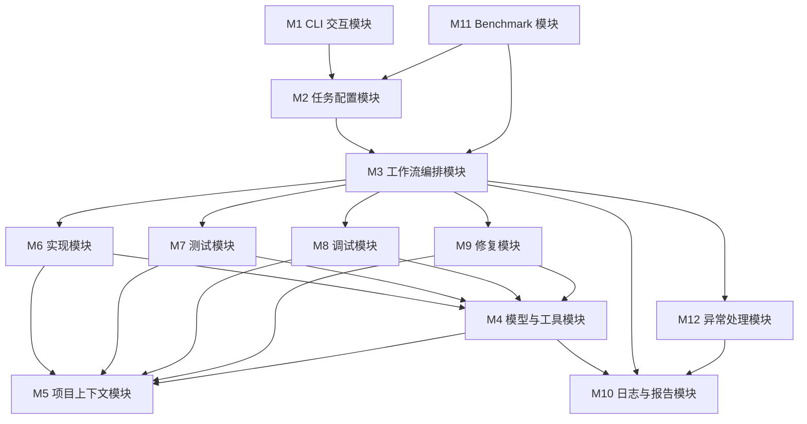

# 02 模块划分与职责设计

## 1. 模块划分原则

模块划分遵循以下原则：

1. CLI、配置、工作流、工具、报告、Benchmark 相互独立，降低耦合；
2. 四个阶段模块只负责阶段业务逻辑，公共能力下沉到 context、tools、reports、runtime；
3. 有副作用操作只通过 tools 和 patch service 执行，不允许 Agent 节点直接写项目文件；
4. Java、多测试框架、多模型供应商通过 Adapter 接口预留，不进入 MVP 主路径；
5. Git 不作为模块，不出现在核心依赖链中。

## 2. 模块总览



## 3. 模块职责表

| 模块 | 主要职责 | 输入 | 输出 | 关键类/接口 |
|---|---|---|---|---|
| M1 CLI 交互模块 | 命令解析、wizard、审批交互、进度展示、resume 命令 | CLI 参数、用户输入 | TaskConfig 草案、HumanDecision、进度文本 | `CliApp`, `WizardController`, `ProgressRenderer`, `ApprovalConsole` |
| M2 任务配置模块 | 解析 YAML/JSON/CLI 参数，校验阶段连续性、路径、语言和测试框架 | 命令参数、task.yaml | `TaskConfig`, `RunContext` | `TaskConfigLoader`, `StageValidator`, `PathValidator`, `RunInitializer` |
| M3 工作流编排模块 | 构建主图和四个阶段子图，管理 checkpoint、条件路由、stream 输出 | `TaskConfig`, `AgentState` | `StageResult`, `FinalResult` | `WorkflowFactory`, `MainWorkflowGraph`, `StageRouter`, `CheckpointManager` |
| M4 模型与工具模块 | 模型客户端、提示词、结构化输出、工具注册、工具级 HITL | prompt、state、tool call | LLM 输出、ToolResult | `ModelClientFactory`, `PromptRegistry`, `ToolRegistry`, `ToolPermissionPolicy` |
| M5 项目上下文模块 | 扫描目录、读取文件、代码搜索、敏感文件过滤、上下文摘要 | 项目路径、搜索关键词 | `ProjectProfile`, `ContextBundle` | `ProjectScanner`, `FileReader`, `CodeSearcher`, `ContextManager` |
| M6 实现模块 | 输入解析、实现计划、代码 patch 生成、语法检查、实现报告 | 需求材料、项目结构 | implementation patch/report | `ImplementationPlanner`, `CodePatchGenerator`, `ImplementationVerifier` |
| M7 测试模块 | 测试目标分析、测试方案生成与审核、pytest 测试文件生成、测试执行与解析 | 需求、代码、实现报告 | test_plan、test_patch、test_report | `TestPlanGenerator`, `PytestGenerator`, `PytestRunner`, `PytestResultParser` |
| M8 调试模块 | 失败日志读取、复现、失败测试定位、源码搜索、LLM 根因分析、故障归因、修复建议 | 失败日志、测试报告、源码、最新 repair 失败产物 | fault_localization、llm_debug_analysis、root_cause、debug_report | `FailureAnalyzer`, `Reproducer`, `FaultLocalizer`, `RootCauseAnalyzer`, `DebuggingAnalysisProvider` |
| M9 修复模块 | 修复计划、最小 patch、风险检查、审批应用、回归验证、多轮修复、保守可见测试修复 | 调试结果、失败测试、源码、测试修复许可 | repair.patch、after_test.log、repair_report | `RepairPlanner`, `RepairPatchGenerator`, `PatchRiskChecker`, `RepairVerifier` |
| M10 日志与报告模块 | metadata、transcript、decision_trace、阶段报告、最终报告、artifact index | 运行事件、阶段结果 | 报告与 JSONL 产物 | `ReportWriter`, `TranscriptRecorder`, `DecisionTraceRecorder`, `ArtifactStore` |
| M11 Benchmark 模块 | 读取 benchmark.yaml，复制原始 case 到干净运行副本，批量运行案例，统计成功率和失败原因 | benchmark.yaml、原始 case 目录 | case 运行副本、benchmark_result.json/md | `BenchmarkRunner`, `CaseLoader`, `MetricAggregator` |
| M12 异常处理模块 | 路径、模型、工具、shell、pytest、用户取消、超时异常处理 | Exception、state | ErrorRecord、降级路径、失败报告 | `ErrorClassifier`, `RetryPolicyFactory`, `FailureReporter` |

## 4. 包结构建议

```text
codeagent/
├── __init__.py
├── __main__.py
├── cli/
│   ├── app.py
│   ├── wizard.py
│   ├── approval_console.py
│   └── progress.py
├── config/
│   ├── schema.py
│   ├── loader.py
│   ├── validators.py
│   └── defaults.py
├── workflow/
│   ├── state.py
│   ├── factory.py
│   ├── main_graph.py
│   ├── routing.py
│   ├── checkpoint.py
│   └── subgraphs/
│       ├── implementation.py
│       ├── testing.py
│       ├── debugging.py
│       └── repair.py
├── agents/
│   ├── prompts.py
│   ├── structured_outputs.py
│   ├── planner.py
│   ├── coder.py
│   ├── tester.py
│   ├── debugger.py
│   └── repairer.py
├── tools/
│   ├── registry.py
│   ├── permissions.py
│   ├── file_tools.py
│   ├── search_tools.py
│   ├── patch_tools.py
│   ├── shell_tools.py
│   └── pytest_tools.py
├── context/
│   ├── scanner.py
│   ├── file_reader.py
│   ├── code_search.py
│   ├── summarizer.py
│   └── sensitive_filter.py
├── stages/
│   ├── implementation_service.py
│   ├── testing_service.py
│   ├── debugging_service.py
│   └── repair_service.py
├── reports/
│   ├── writer.py
│   ├── transcript.py
│   ├── decision_trace.py
│   ├── artifact_store.py
│   └── templates/
├── benchmark/
│   ├── runner.py
│   ├── case_loader.py
│   ├── metrics.py
│   └── report.py
├── adapters/
│   ├── language.py
│   ├── python_adapter.py
│   ├── java_adapter.py
│   ├── test_framework.py
│   └── pytest_adapter.py
└── errors/
    ├── exceptions.py
    ├── classifier.py
    ├── retry.py
    └── failure_reporter.py
```

## 5. 依赖规则

### 5.1 允许依赖

```text
cli → config → workflow → stages → agents/tools/context/reports
benchmark → config/workflow/reports
errors → reports
adapters → tools/stages
```

### 5.2 禁止依赖

| 禁止依赖 | 原因 |
|---|---|
| agents 直接依赖 cli | Agent 节点不能直接读用户输入，必须通过 state 和 HITL |
| agents 直接写项目文件 | 破坏 patch-first 和审批机制 |
| stages 直接操作 SQLite | checkpoint 应由 workflow/checkpoint 统一管理 |
| tools 直接做阶段路由 | 工具只返回结果，不决定工作流跳转 |
| reports 调用 LLM | 报告模块只渲染已有结果，避免副作用和不可复现 |
| 任意模块依赖 Git 模块 | 本项目不考虑 Git 工作区检查 |

## 6. 阶段模块内部职责

### 6.1 实现模块

```text
ImplementationPlanner
→ RequirementExtractor
→ ProjectImpactAnalyzer
→ CodePatchGenerator
→ PatchScopeChecker
→ ImplementationVerifier
→ ImplementationReportWriter
```

关键设计：实现模块输出 `implementation/patch.diff`，不直接写项目源码；补丁审批和应用通过工作流节点完成。

### 6.2 测试模块

```text
TestTargetAnalyzer
→ TestPlanGenerator
→ TestPlanReviewNode
→ PytestGenerator
→ TestPatchReviewNode
→ TestCommandApprovalNode
→ PytestRunner
→ PytestResultParser
→ TestReportWriter
```

关键设计：测试阶段先生成测试方案，方案批准后才生成测试文件；测试文件同样以 `test_patch.diff` 形式进入审批。

### 6.3 调试模块

```text
FailureLogCollector
→ Reproducer
→ FailureSummarizer
→ FaultLocalizer
→ LlmDebugAnalyzer
→ RootCauseAnalyzer
→ RepairPlanDraftWriter
→ DebugReportWriter
```

关键设计：调试阶段可能无法自动复现；若无测试命令，则进入基于日志和源码的静态分析路径，并在报告中降低置信度。静态定位后会调用 LLM 生成结构化 `DebuggingAnalysis`，输出故障归因、候选文件、证据、根因、修复策略和测试修复许可。若 LLM 不可用或结构化输出失败，调试阶段降级使用静态定位，不中断整个工作流。

### 6.4 修复模块

```text
RepairPlanner
→ RepairPatchGenerator
→ PatchRiskChecker
→ RepairPatchReviewNode
→ PatchApplier
→ RepairVerifier
→ RepairReportWriter
```

关键设计：修复失败后不是直接结束，而是在最大轮数内返回调试/修复闭环；达到上限后输出失败报告和下一步建议。repair 默认只修改产品/源码文件；只有调试分析明确判定为 `generated_test_code`、`mixed` 或 `test_harness` 并给出证据时，repair plan 才能设置 `test_repair_allowed=true`，从而允许修改可见生成测试中的语法、导入、cwd、subprocess 编码、fixture、`null` 等明显测试错误。隐藏 oracle、evaluation、expected_result、pytest 配置、删除/跳过/弱化断言始终拒绝。

## 7. 角色节点与 Agent 边界

本设计中的 Planner、Coder、Debugger、Repairer 等不是独立长生命周期 Agent，不做互相对话；它们是 LangGraph 节点或服务类，具有清晰输入输出。

| 角色节点 | 输入 | 输出 | 是否可调用工具 |
|---|---|---|---|
| Planner | 需求、项目摘要、阶段目标 | 结构化计划 | 只读工具 |
| Coder | 实现计划、相关源码 | patch 草案 | 文件读取、搜索、patch 生成 |
| TestDesigner | 需求、实现报告、代码摘要 | test_plan | 只读工具 |
| TestWriter | test_plan、代码上下文 | test_patch | 文件读取、搜索、patch 生成 |
| Debugger | 测试日志、失败报告、源码、最新 repair 失败产物 | fault_localization、llm_debug_analysis、root_cause | 读取、搜索、可选 shell 复现、LLM 结构化分析 |
| Repairer | root_cause、repair_plan、源码、测试修复许可 | repair.patch | 读取、搜索、patch 生成 |
| Verifier | patch、pytest 结果 | pass/fail、风险 | shell、pytest parser |

## 8. 模块实现优先级

| 阶段 | P0 最小实现 | P1 增强 |
|---|---|---|
| CLI/config | `run --config`、`wizard` 基本输入、路径校验 | resume、丰富进度 UI、配置模板生成 |
| workflow | 主图 + 四阶段子图 + 条件路由 | 子图状态检查、time travel、可视化导出 |
| tools | scan/read/search/patch/run_pytest/parse_pytest/write_report | 工具调用限制、敏感信息脱敏、上下文压缩 |
| implementation | 计划、patch、报告 | 语法检查闭环、约束映射表 |
| testing | test_plan、审批、pytest、报告 | 覆盖率、回归测试分组 |
| debugging | 日志解析、源码搜索、根因分析 | 可疑位置排序置信度、调用链分析 |
| repair | repair patch、审批、回归验证 | 过拟合检测、多轮修复优化 |
| benchmark | 批量运行、成功率 | 分类统计、失败聚类 |

## 实现对齐变更记录

| 日期 | 变更 | 原因 | 影响 |
|---|---|---|---|
| 2026-06-03 | M11 Benchmark 模块职责补充“复制原始 case 到干净运行副本”。 | 防止 benchmark 原始案例被 Agent 或测试流程污染。 | 不改变课程验收范围；实现时 BenchmarkRunner 需提供 case 运行副本准备能力。 |
