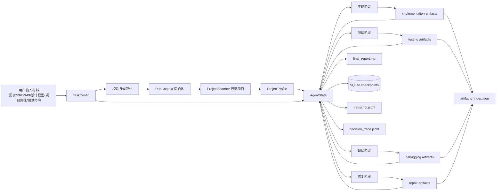

# 03 数据流与状态模型设计

## 1. 数据流设计目标

数据流设计需要解决四个问题：

1. 用户提供的材料如何进入 Agent 上下文；
2. 前一阶段的输出如何成为后一阶段的输入；
3. LangGraph 的 `AgentState` 如何表达当前工作流状态；
4. 输出目录如何保存可复现、可审计的运行产物。

本系统以 `TaskConfig` 作为运行入口，以 `AgentState` 作为 LangGraph 状态载体，以 `ArtifactStore` 作为产物索引，以 SQLite checkpoint 保存阶段状态和中断恢复信息。

## 2. 顶层数据流



## 3. 阶段输入输出流转

| 阶段 | 主要输入 | 主要输出 | 流转到下一阶段 |
|---|---|---|---|
| 实现 | requirements、project_profile、constraints、acceptance_criteria | `implementation_plan.md`、`patch.diff`、`changed_files.json`、`implementation_report.md` | 测试阶段读取实现报告、变更清单、验收映射 |
| 测试 | project_profile、requirements、implementation_report、test_command | `test_plan.md`、`test_patch.diff`、`test_report.json`、测试日志 | 若失败，调试阶段读取失败测试、错误摘要、日志路径 |
| 调试 | test_report、failure logs、buggy project、expected behavior | `fault_localization.json`、`root_cause.md`、`repair_plan.md`、`debug_report.md` | 修复阶段读取可疑位置、根因、修复建议 |
| 修复 | root_cause、repair_plan、fault_localization、test_command | `repair.patch.diff`、`after_test.log`、`repair_report.md` | 若失败且未超限，回流调试/修复；若成功进入 final_report |

## 4. AgentState 设计

`AgentState` 是 LangGraph 所有节点共享的状态。建议用 `TypedDict` 表示图状态，用 Pydantic 表示持久化领域对象。

```python
from typing import Annotated, Literal, TypedDict
import operator

class AgentState(TypedDict, total=False):
    # 基础运行信息
    run_id: str
    task_config: dict
    current_stage: Literal["implement", "test", "debug", "repair", "final"]
    current_node: str
    selected_stages: list[str]
    mode: Literal["wizard", "run", "benchmark", "resume"]

    # 项目与上下文
    project_profile: dict
    input_materials: list[dict]
    context_summary: str
    context_budget: dict
    sensitive_files_skipped: list[str]

    # 对话和可审计记录
    messages: Annotated[list[dict], operator.add]
    tool_calls: Annotated[list[dict], operator.add]
    decision_trace: Annotated[list[dict], operator.add]
    human_decisions: Annotated[list[dict], operator.add]
    todo_list: list[dict]

    # 阶段结果
    implementation_result: dict
    testing_result: dict
    debugging_result: dict
    repair_result: dict
    benchmark_result: dict

    # 当前工作产物
    pending_patch: dict
    pending_test_plan: dict
    pending_command: dict
    artifacts: Annotated[list[dict], operator.add]

    # 路由和失败控制
    status: Literal["running", "waiting_human", "succeeded", "failed", "cancelled"]
    error_records: Annotated[list[dict], operator.add]
    retry_counters: dict
    repair_attempt: int
    max_repair_attempts: int
    next_action: str
```

## 5. 核心领域对象

### 5.1 TaskConfig

```python
class TaskConfig(BaseModel):
    task_id: str | None = None
    stages: list[Literal["implement", "test", "debug", "repair"]]
    project_path: Path
    output_dir: Path | None = None
    input_materials: list[InputMaterial] = []
    test_command: str | None = "pytest -q"
    model_config: ModelConfig
    language: Literal["python"] = "python"
    test_framework: Literal["pytest"] = "pytest"
    mode: Literal["wizard", "run", "benchmark"] = "run"
    max_repair_attempts: int = 3
    command_timeout_seconds: int = 120
    log_truncation_chars: int = 12000
    auto_approve_in_benchmark: bool = True
```

### 5.2 ProjectProfile

```python
class ProjectProfile(BaseModel):
    root: Path
    language: Literal["python"]
    source_dirs: list[Path]
    test_dirs: list[Path]
    config_files: list[Path]
    dependency_files: list[Path]
    entry_points: list[Path] = []
    file_count: int
    summary: str
```

### 5.3 StageResult

```python
class StageResult(BaseModel):
    stage: str
    status: Literal["succeeded", "failed", "skipped", "cancelled"]
    started_at: str
    ended_at: str
    artifacts: list[str]
    summary: str
    failure_reason: str | None = None
    next_suggestion: str | None = None
```

### 5.4 ToolCallRecord

```python
class ToolCallRecord(BaseModel):
    call_id: str
    tool_name: str
    args_summary: dict
    output_summary: str
    status: Literal["succeeded", "failed", "blocked", "skipped"]
    started_at: str
    ended_at: str
    artifact_paths: list[str] = []
    error: str | None = None
```

### 5.5 HumanDecision

```python
class HumanDecision(BaseModel):
    interrupt_id: str
    action: Literal["review_test_plan", "approve_patch", "approve_command", "review_tool_call"]
    decision_type: Literal["approve", "edit", "reject", "respond", "cancel"]
    comment: str | None = None
    edited_payload: dict | None = None
    timestamp: str
```

## 6. 上下文管理设计

### 6.1 上下文来源

| 来源 | 进入方式 | 使用阶段 |
|---|---|---|
| 需求/PRD/用户故事 | 读取并摘要 | 实现、测试 |
| API 规格/设计模型 | 读取并抽取接口/约束 | 实现、测试 |
| 项目结构 | ProjectScanner 摘要 | 全阶段 |
| 源码文件 | 按需读取、搜索 | 实现、测试、调试、修复 |
| 测试日志 | 原文落盘，摘要入 state | 测试、调试、修复 |
| 阶段报告 | 文件路径 + 摘要入 state | 后续阶段 |
| 用户反馈 | HumanDecision + decision_trace | 测试、修复、命令审批 |

### 6.2 上下文预算策略

| 内容 | 策略 |
|---|---|
| 小文件 | 可完整送入模型，但保留最大字符数限制 |
| 大文件 | 先用搜索定位片段，再读取相关窗口 |
| 测试日志 | 原文写入 `.log`，模型只接收失败摘要、栈追踪和尾部关键片段 |
| 项目目录 | 只发送目录树摘要、依赖文件、候选源码文件 |
| 历史消息 | 只保留当前阶段必要消息，阶段结束生成 `context_summary` |
| 多轮修复 | 每轮保留 patch 摘要、pytest 失败摘要、根因变化，不重复塞入全部日志 |

### 6.3 敏感文件跳过

默认跳过：

```text
.env
*.pem
*.key
id_rsa
id_dsa
*.p12
*.pfx
*token*
*secret*
__pycache__/
.venv/
.git/
dist/
build/
```

跳过结果写入 `sensitive_files_skipped` 和 `decision_trace`，报告中只显示路径模式，不展示内容。

## 7. 运行产物目录

```text
codeagent_runs/
└── <run_id>/
    ├── metadata.json
    ├── task_config.yaml
    ├── checkpoints.sqlite
    ├── transcript.jsonl
    ├── decision_trace.jsonl
    ├── artifacts_index.json
    ├── implementation/
    │   ├── implementation_plan.md
    │   ├── patch.diff
    │   ├── changed_files.json
    │   ├── build.log
    │   ├── stage_result.json
    │   └── implementation_report.md
    ├── testing/
    │   ├── test_plan.md
    │   ├── test_plan_review.json
    │   ├── test_patch.diff
    │   ├── test_stdout.log
    │   ├── test_stderr.log
    │   ├── test_report.json
    │   ├── test_report.md
    │   └── stage_result.json
    ├── debugging/
    │   ├── reproduction_report.md
    │   ├── failure_summary.md
    │   ├── fault_localization.json
    │   ├── root_cause.md
    │   ├── repair_plan.md
    │   ├── debug_trace.jsonl
    │   ├── debug_report.md
    │   └── stage_result.json
    ├── repair/
    │   ├── repair_plan.final.md
    │   ├── repair.patch.diff
    │   ├── before_test.log
    │   ├── after_test.log
    │   ├── changed_files.json
    │   ├── repair_report.md
    │   └── stage_result.json
    ├── benchmark/
    │   ├── benchmark_result.json
    │   └── benchmark_report.md
    └── final_report.md
```

## 8. 状态写入策略

| 数据 | 写入 AgentState | 写入文件 | 写入 SQLite checkpoint |
|---|---:|---:|---:|
| TaskConfig | 是 | `task_config.yaml` | 是 |
| ProjectProfile | 是 | `metadata.json` 摘要 | 是 |
| 大文件内容 | 否，仅摘要/片段 | 原始文件仍在项目目录 | 否 |
| 测试 stdout/stderr | 否，仅摘要 | `.log` | 摘要是 |
| LLM 可见输出 | 是，必要部分 | `transcript.jsonl` | 是 |
| 隐藏思维链 | 否 | 否 | 否 |
| decision trace | 是 | `decision_trace.jsonl` | 是 |
| patch | 路径+摘要 | `.diff` | 路径+摘要 |
| 阶段报告 | 路径+摘要 | `.md`/`.json` | 路径+摘要 |

## 9. 数据一致性规则

1. `artifacts_index.json` 是所有产物的唯一索引，阶段报告中引用的路径必须能在其中找到。
2. `stage_result.json` 必须在每个阶段结束时写入，无论成功、失败还是跳过。
3. `final_report.md` 只能依据 `StageResult`、`ArtifactStore` 和 `decision_trace` 生成，不能重新询问模型编造结果。
4. 所有有副作用工具调用必须形成 `ToolCallRecord`。
5. 所有人工审批必须形成 `HumanDecision`。
6. 任何模型输出的结构化数据必须经过 Pydantic 校验，失败时进入重试或降级路径。
