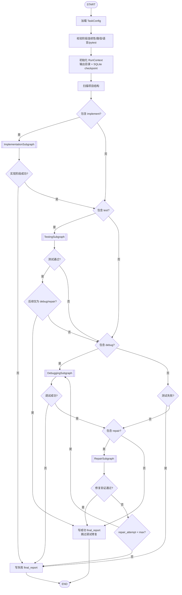
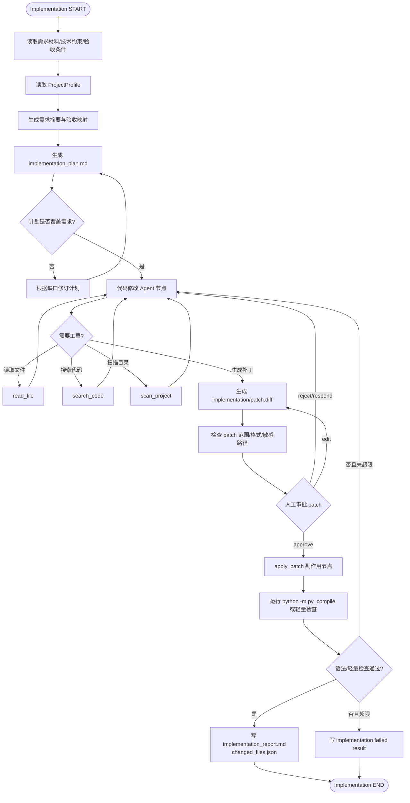
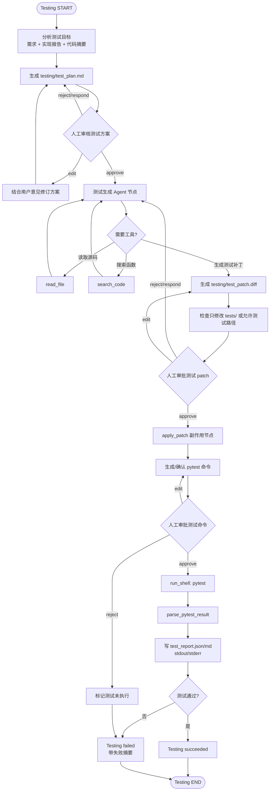
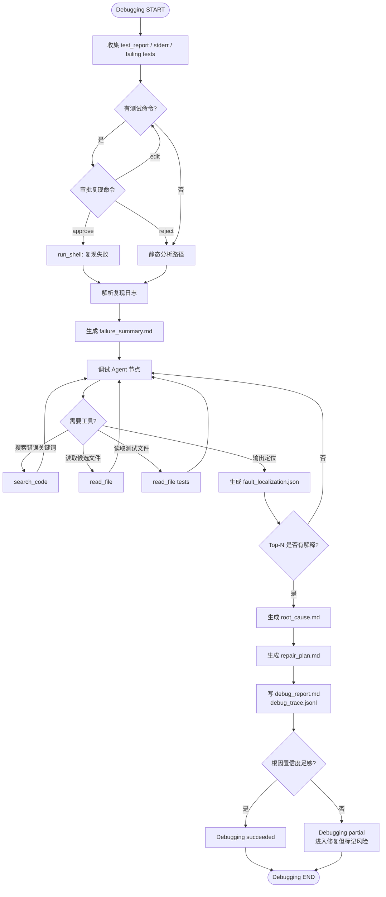
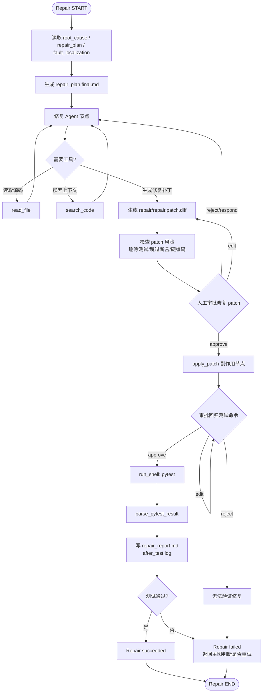
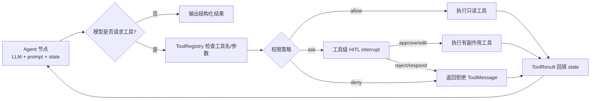
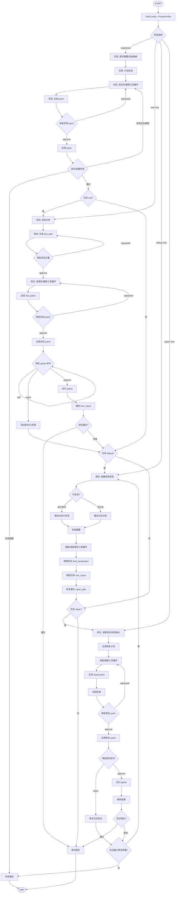

# 04 LangGraph 工作流设计

## 1. 设计目标

LangGraph 是本项目最核心的系统设计产物。图设计需要满足：

1. 支持用户选择单阶段或连续多阶段执行；
2. 明确实现、测试、调试、修复四个阶段子图；
3. 显式表现测试失败进入调试、修复后回归验证、多轮修复闭环；
4. 显式表现阶段内工具调用循环，而不是简单线性流水线；
5. 显式表现 HITL 审批节点；
6. 支持 SQLite checkpoint、interrupt/resume、streaming 进度输出；
7. 副作用操作必须放在审批节点之后，避免中断恢复导致重复副作用。

## 2. 图设计规则

| 规则 | 说明 |
|---|---|
| R1：主图负责阶段路由 | 主图不写具体业务逻辑，只判断是否进入某阶段、是否跳过、是否失败 |
| R2：阶段逻辑放入子图 | 实现、测试、调试、修复分别用子图表达，便于单独测试和展示 |
| R3：LLM 节点输出结构化数据 | 计划、测试方案、故障定位、修复计划等使用 Pydantic schema |
| R4：工具循环显式化 | `agent_node → need_tool? → tool_node → agent_node` |
| R5：HITL 节点纯审批 | 审批节点只 interrupt，不执行文件写入、patch 应用、shell |
| R6：副作用节点幂等 | `apply_patch`、`run_pytest`、`write_report` 检查产物存在和 call_id |
| R7：所有路由写入 decision_trace | 每次条件边选择都记录摘要原因 |
| R8：修复闭环有上限 | 默认 `max_repair_attempts=3`，达到上限生成失败报告 |

## 3. 主工作流图



## 4. 实现阶段子图

实现阶段重点是需求解析、实现计划、代码 patch 生成、patch 审批、应用后语法检查。它不是“模型一次生成代码后结束”，而是包含读取/搜索工具循环和检查失败后的修订循环。



### 实现阶段关键状态字段

| 字段 | 说明 |
|---|---|
| `implementation_result.plan_path` | 实现计划路径 |
| `pending_patch.path` | 待审批 patch 路径 |
| `pending_patch.summary` | 修改文件、增删行摘要 |
| `implementation_result.changed_files` | 应用后的变更清单 |
| `implementation_result.syntax_check` | 语法/轻量检查结果 |
| `implementation_result.status` | succeeded/failed/cancelled |

## 5. 测试阶段子图

测试阶段必须先生成测试方案，人工审核后才生成 pytest 测试文件。测试文件仍采用 patch-first。测试命令执行前也必须审批；Benchmark 模式可以由配置自动批准。



### 测试阶段路由输出

| 测试状态 | 后续阶段包含 debug? | 主图行为 |
|---|---:|---|
| 全部通过 | 是/否 | 记录成功；若后续只有 debug/repair，则跳过并结束成功 |
| 失败 | 是 | 进入 DebuggingSubgraph |
| 失败 | 否 | 写失败 final_report |
| 用户拒绝执行命令 | 是 | 可进入调试的静态日志路径，但置信度较低 |
| 用户取消 | 任意 | 停止运行，写 cancelled |

## 6. 调试阶段子图

调试阶段包含复现、日志摘要、源码搜索、可疑位置排序、根因分析、修复建议。若没有测试命令，则跳过自动复现，进入基于日志/源码的静态分析路径。



### 调试阶段置信度

| 情况 | 置信度影响 |
|---|---|
| 能复现失败且日志稳定 | 提高 |
| 失败测试名称和源码函数能匹配 | 提高 |
| 只有用户提供日志，无测试命令 | 降低 |
| 候选位置超过 5 个且缺少明确证据 | 降低 |
| 根因只来自推测，没有工具证据 | 降低 |

## 7. 修复阶段子图

修复阶段根据调试产物生成最终修复计划和最小 patch。patch 审批后应用，再运行 pytest。失败后返回主图，由主图判断是否继续调试/修复闭环。



## 8. 阶段内通用工具调用循环

各阶段的 Agent 节点共享一种受控工具循环：



工具循环必须设置最大工具调用次数，默认建议：单个 Agent 节点最多 12 次工具调用；同一工具连续失败 2 次后要求模型换策略或进入失败处理。

## 9. 总合并图

以下图把四个阶段内部关键闭环合并展示，适合在最终系统设计方案中作为“总 LangGraph 图”的 Mermaid 图。



## 10. 条件路由函数设计

```python
def route_after_testing(state: AgentState) -> str:
    result = state["testing_result"]
    if result["status"] == "cancelled":
        return "final_cancelled"
    if result["status"] == "succeeded" and result["failed"] == 0:
        return "final_success"
    if "debug" in state["selected_stages"]:
        return "debugging"
    return "final_failed"


def route_after_repair(state: AgentState) -> str:
    result = state["repair_result"]
    if result["success"]:
        return "final_success"
    if state.get("repair_attempt", 0) < state.get("max_repair_attempts", 3):
        return "debugging"
    return "final_failed"
```

## 11. Checkpoint 与 thread_id

- 每次运行生成唯一 `run_id`；
- LangGraph `thread_id` 使用 `run_id`；
- SQLite 文件放在 `codeagent_runs/<run_id>/checkpoints.sqlite`；
- 所有 interrupt 恢复必须使用同一个 `thread_id`；
- `resume --run-id <run_id>` 会读取 `task_config.yaml` 和 checkpoint，继续执行等待中的 interrupt 或失败后的可恢复节点。

示例：

```python
config = {"configurable": {"thread_id": run_id}}
for event in graph.stream(initial_state, config=config, stream_mode=["updates", "custom", "messages"]):
    render_event(event)

# 人工审批后
for event in graph.stream(Command(resume=human_decision), config=config, stream_mode=["updates", "custom"]):
    render_event(event)
```

## 12. Streaming 事件设计

| event type | 用途 | CLI 示例 |
|---|---|---|
| `updates` | 节点完成后的状态更新 | `[测试阶段] test_plan 已生成` |
| `custom` | 节点内部进度 | `[工具] 正在搜索 "calculate_total"` |
| `messages` | 可选显示模型输出 token | `[Agent] 正在解释失败原因...` |
| `checkpoints` | 调试或 resume 使用 | `[checkpoint] 已保存到 run_id=...` |
| `debug` | 开发模式使用 | 仅 debug 日志，不默认展示给用户 |

## 13. 中断恢复与副作用安全

审批节点设计为纯节点：

```text
approve_patch_node: interrupt(diff + summary) → HumanDecision
apply_patch_node: 根据 HumanDecision 执行 apply_patch
```

禁止这样设计：

```text
bad_node: 先写文件 → interrupt → 恢复后继续
```

因为从 interrupt 恢复时节点可能重新执行，副作用可能重复发生。所有副作用必须拆到审批后的独立节点，并用 `operation_id` 保证幂等。
