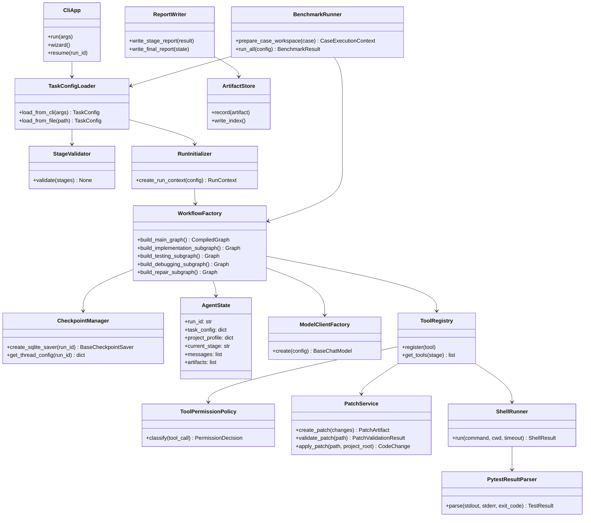

# 05 核心类与接口设计

## 1. 设计目标

核心类与接口设计服务于两个目标：

1. 为系统实现提供清晰的领域模型、服务边界和扩展接口；
2. 满足课程设计方案中“核心类/接口设计”的交付要求。

本系统不是大型 OOP 框架，但需要稳定的数据模型和接口边界。建议领域对象使用 Pydantic，LangGraph State 使用 TypedDict，工具接口使用普通函数 + LangChain `@tool` 包装。

## 2. 核心类图



## 3. 领域模型

### 3.1 Stage 枚举

```python
from enum import Enum

class Stage(str, Enum):
    IMPLEMENT = "implement"
    TEST = "test"
    DEBUG = "debug"
    REPAIR = "repair"
```

### 3.2 ModelConfig

```python
from pydantic import BaseModel, Field

class ModelConfig(BaseModel):
    provider: str = "openai_compatible"
    model_name: str = "anthropic/claude-opus-4.8"
    base_url: str = "https://openrouter.ai/api/v1"
    api_key_env: str = "OPENROUTER_API_KEY"
    temperature: float = 0.2
    timeout_seconds: int = 120
    max_retries: int = 2
    max_tokens: int | None = None
```

### 3.3 InputMaterial

```python
class InputMaterial(BaseModel):
    material_type: Literal[
        "requirements", "prd", "user_story", "api_spec",
        "design_model", "constraints", "acceptance", "log", "sample"
    ]
    path: Path
    required: bool = False
    multi: bool = True
    description: str | None = None
```

### 3.4 TaskConfig

```python
class TaskConfig(BaseModel):
    task_id: str | None = None
    stages: list[Stage]
    project_path: Path
    output_dir: Path | None = None
    input_materials: list[InputMaterial] = []
    model_config: ModelConfig = Field(default_factory=ModelConfig)
    test_command: str = "pytest -q"
    language: Literal["python"] = "python"
    test_framework: Literal["pytest"] = "pytest"
    mode: Literal["wizard", "run", "benchmark"] = "run"
    max_repair_attempts: int = 3
    command_timeout_seconds: int = 120
    log_truncation_chars: int = 12000
    auto_approve_in_benchmark: bool = False
```

### 3.5 ArtifactRecord

```python
class ArtifactRecord(BaseModel):
    artifact_id: str
    stage: str
    kind: Literal["report", "patch", "log", "json", "code", "config"]
    path: Path
    summary: str
    created_at: str
    related_requirement_ids: list[str] = []
```

### 3.6 TestResult

```python
class TestResult(BaseModel):
    command: str
    exit_code: int
    passed: int | None = None
    failed: int | None = None
    errors: int | None = None
    skipped: int | None = None
    duration_seconds: float | None = None
    failing_tests: list[str] = []
    error_summary: str | None = None
    stdout_path: Path
    stderr_path: Path
```

### 3.7 FaultLocalization

```python
class SuspectLocation(BaseModel):
    file_path: Path
    symbol: str | None = None
    line_start: int | None = None
    line_end: int | None = None
    confidence: float = Field(ge=0, le=1)
    evidence: list[str]

class FaultLocalization(BaseModel):
    failing_tests: list[str]
    suspects: list[SuspectLocation]
    root_cause_summary: str
```

## 4. 服务接口设计

### 4.1 WorkflowFactory

```python
class WorkflowFactory(Protocol):
    def build(self, config: TaskConfig) -> CompiledStateGraph:
        """构建主 LangGraph 图，并注入 SQLite checkpointer、模型和工具。"""
```

职责：

- 创建主图；
- 创建四个阶段子图；
- 注入 checkpoint；
- 注册节点默认 retry/timeout/error handler；
- 返回可 stream/invoke/resume 的 compiled graph。

### 4.2 StageRouter

```python
class StageRouter:
    def route_after_implementation(self, state: AgentState) -> str: ...
    def route_after_testing(self, state: AgentState) -> str: ...
    def route_after_debugging(self, state: AgentState) -> str: ...
    def route_after_repair(self, state: AgentState) -> str: ...
```

职责：

- 根据 `selected_stages` 和阶段结果决定下一节点；
- 将路由原因写入 `decision_trace`；
- 避免前一阶段失败后盲目进入后一阶段。

### 4.3 ModelClientFactory

```python
class ModelClientFactory:
    def create(self, config: ModelConfig) -> BaseChatModel:
        return ChatOpenAI(
            model=config.model_name,
            base_url=config.base_url,
            api_key=os.environ[config.api_key_env],
            temperature=config.temperature,
            timeout=config.timeout_seconds,
            max_retries=config.max_retries,
            max_tokens=config.max_tokens,
        )
```

职责：

- 统一 OpenAI-compatible 模型调用；
- 不在业务逻辑中写死 API Key；
- 支持未来替换模型供应商。

### 4.4 ToolRegistry

```python
class ToolRegistry:
    def __init__(self, policy: ToolPermissionPolicy): ...
    def register_common_tools(self) -> None: ...
    def get_stage_tools(self, stage: Stage) -> list[BaseTool]: ...
    def get_readonly_tools(self) -> list[BaseTool]: ...
    def get_side_effect_tools(self) -> list[BaseTool]: ...
```

职责：

- 按阶段暴露不同工具；
- 将工具分为 readonly / patch-producing / side-effect；
- 配合 LangChain HITL middleware 拦截危险工具。

### 4.5 PatchService

```python
class PatchService(Protocol):
    def create_unified_diff(self, changes: list[FileChange]) -> PatchArtifact: ...
    def validate_patch(self, patch_path: Path, project_root: Path) -> PatchValidationResult: ...
    def summarize_patch(self, patch_path: Path) -> PatchSummary: ...
    def apply_patch(self, patch_path: Path, project_root: Path, operation_id: str) -> CodeChangeResult: ...
```

设计要求：

- 不依赖 Git；
- patch 路径必须在项目目录或允许的测试目录内；
- 应用前检查审批记录；
- 应用后记录 changed_files。

### 4.6 ShellRunner

```python
class ShellRunner(Protocol):
    def run(
        self,
        command: str,
        cwd: Path,
        timeout_seconds: int,
        env: dict[str, str] | None = None,
        operation_id: str | None = None,
    ) -> ShellResult: ...
```

设计要求：

- 只执行用户配置或审批后的命令；
- 捕获 stdout、stderr、exit_code、duration；
- 超时后终止子进程；
- 保存日志到输出目录；
- benchmark 模式可按配置自动审批。

### 4.7 ArtifactStore

```python
class ArtifactStore:
    def record(self, artifact: ArtifactRecord) -> None: ...
    def find_by_stage(self, stage: str) -> list[ArtifactRecord]: ...
    def write_index(self) -> Path: ...
```

职责：

- 维护所有产物索引；
- 防止报告中引用不存在的文件；
- 为 final_report 提供路径和摘要。

### 4.8 BenchmarkRunner

```python
class CaseExecutionContext(BaseModel):
    case_id: str
    source_case_dir: Path
    run_case_dir: Path
    agent_workspace: Path
    visible_paths: list[Path]
    hidden_paths: list[Path]


class BenchmarkRunner(Protocol):
    def prepare_case_workspace(self, case: BenchmarkCase, benchmark_run_dir: Path) -> CaseExecutionContext: ...
    def run_case(self, context: CaseExecutionContext) -> CaseEvaluation: ...
    def run_all(self, config: BenchmarkConfig) -> BenchmarkResult: ...
```

职责：

- 将原始 case 目录视为只读模板；
- 每次运行前复制整个 case 到干净 `run_case_dir`；
- 在执行 `prepare_command` / `test_command` 前，将命令中的 `{{CASE_DIR}}` 替换为 `run_case_dir`；
- 只把运行副本中的可见路径交给 Agent；
- 保证 `evaluation/`、`oracle_tests/`、`expected_result.json` 等隐藏路径只由 evaluator 使用；
- 所有 patch、依赖安装、测试日志和报告都写入运行副本或 run_dir，不回写原始 case。

## 5. Adapter 接口设计

### 5.1 LanguageAdapter

```python
class LanguageAdapter(Protocol):
    name: str
    file_extensions: set[str]

    def scan_project(self, root: Path) -> ProjectProfile: ...
    def syntax_check_command(self, project_root: Path) -> str | None: ...
    def default_test_command(self) -> str: ...
    def format_code_context(self, path: Path, content: str) -> str: ...
```

MVP 实现：`PythonLanguageAdapter`。Java 预留：`JavaLanguageAdapter`，但不进入主流程。

### 5.2 TestFrameworkAdapter

```python
class TestFrameworkAdapter(Protocol):
    name: str

    def default_command(self) -> str: ...
    def discover_test_dirs(self, profile: ProjectProfile) -> list[Path]: ...
    def parse_result(self, shell_result: ShellResult) -> TestResult: ...
    def generate_test_file_hint(self, profile: ProjectProfile) -> str: ...
```

MVP 实现：`PytestAdapter`。

### 5.3 ModelProviderAdapter

```python
class ModelProviderAdapter(Protocol):
    def create_model(self, config: ModelConfig) -> BaseChatModel: ...
```

MVP 实现：`OpenAICompatibleAdapter`，使用 OpenRouter base_url 和 `OPENROUTER_API_KEY`。

## 6. 结构化输出 Schema

| 结构化输出 | 用途 |
|---|---|
| `ImplementationPlan` | 实现阶段任务拆分、目标文件、风险、验收映射 |
| `PatchProposal` | patch 摘要、修改文件、是否需要新增文件 |
| `TestPlan` | 测试范围、测试类型、测试数据、预期结果 |
| `PytestFilePlan` | 测试文件路径、测试函数、覆盖目标 |
| `FailureSummary` | 失败用例、异常类型、栈追踪摘要 |
| `FaultLocalization` | 可疑文件、函数、行号、证据、置信度 |
| `RepairPlan` | 修复目标、修改策略、风险、验证命令 |
| `PatchRiskReport` | 是否删除测试、是否跳过断言、是否硬编码 |

示例：

```python
class TestPlan(BaseModel):
    objectives: list[str]
    scope: list[str]
    test_types: list[Literal["unit", "integration", "regression", "edge"]]
    cases: list[TestCaseSpec]
    acceptance_mapping: list[AcceptanceMapping]
    risks: list[str]
```

## 7. 类与接口落地建议

1. 领域对象使用 Pydantic，便于校验和 JSON 序列化；
2. LangGraph State 使用 `TypedDict`，避免复杂对象难以 checkpoint；
3. 工具函数只接受 JSON 可序列化参数；
4. 文件路径统一使用相对项目根路径或输出目录相对路径保存到 state；
5. 大文本不直接进入 state，只存路径和摘要；
6. 所有外部副作用都通过 `operation_id` 记录，支持恢复后的幂等检查。

## 实现对齐变更记录

| 日期 | 变更 | 原因 | 影响 |
|---|---|---|---|
| 2026-06-03 | 为 `BenchmarkRunner` 增加 `prepare_case_workspace`、`CaseExecutionContext` 和 `{{CASE_DIR}}` 命令替换契约。 | 明确原始 case 只读模板与运行副本边界。 | 不改变课程验收范围；后续实现需测试原始 case 不被修改、命令指向运行副本且隐藏路径不暴露给 Agent。 |
