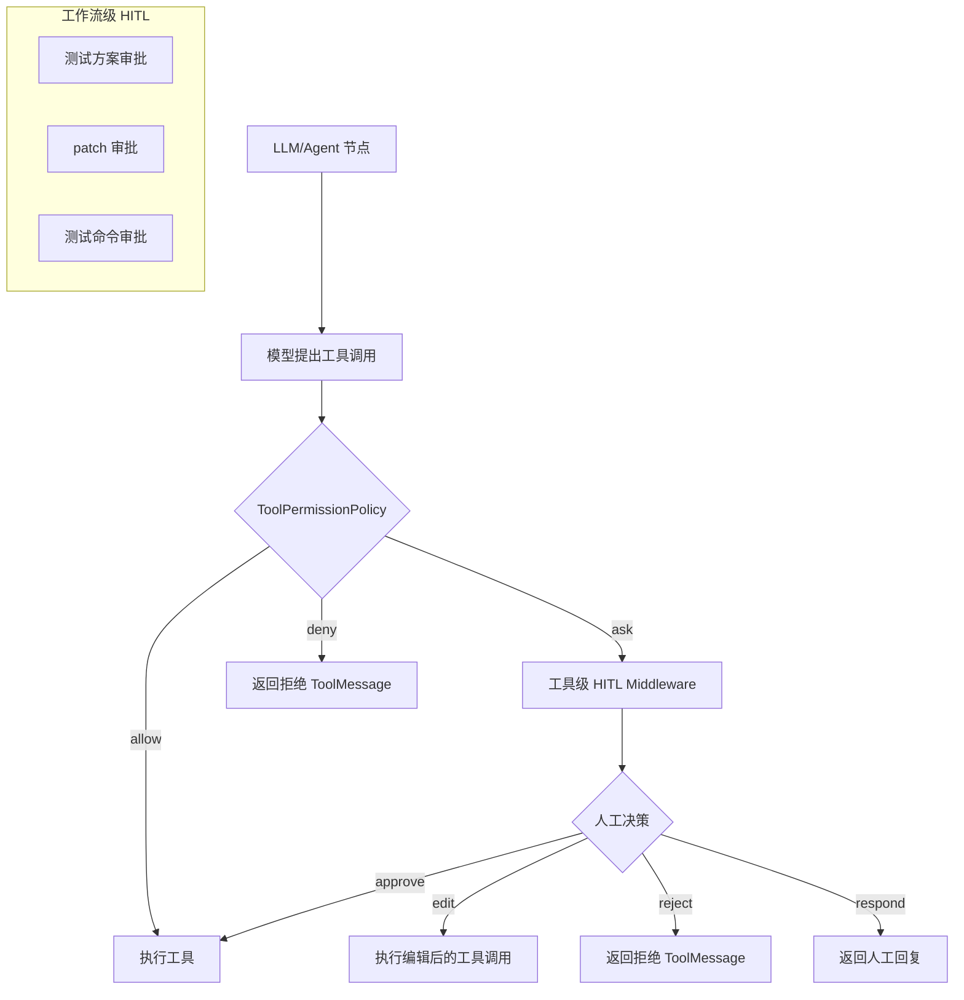
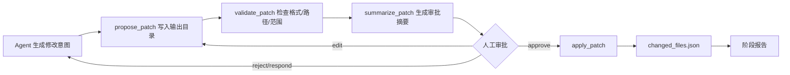

# 06 工具调用与 HITL 设计

## 1. 设计目标

工具调用与 HITL 设计需要同时满足能力和安全性：

1. Agent 能读取项目、搜索代码、生成 patch、执行 pytest、解析日志；
2. 只读工具可以自动执行；
3. 修改源码、修改测试、执行 shell 等有副作用动作必须经过审批；
4. 工作流级 HITL 管业务审批，工具级 HITL 做兜底拦截；
5. 所有审批结果和工具调用必须可审计。

## 2. 工具分类

| 分类 | 工具 | 是否有副作用 | 默认策略 |
|---|---|---:|---|
| 项目扫描 | `scan_project` | 否 | allow |
| 文件读取 | `read_file` | 否 | allow，但跳过敏感文件 |
| 代码搜索 | `search_code` | 否 | allow |
| 日志读取 | `read_log` | 否 | allow，长日志截断摘要 |
| patch 生成 | `propose_patch` | 否，生成输出目录产物 | allow |
| patch 校验 | `validate_patch` | 否 | allow |
| patch 应用 | `apply_patch` | 是，修改项目目录 | ask |
| 报告写入 | `write_report` | 是，但仅输出目录 | allow |
| shell 执行 | `run_shell` | 是，执行本地命令 | ask |
| pytest 解析 | `parse_pytest_result` | 否 | allow |
| artifact 记录 | `record_artifact` | 是，但仅输出目录索引 | allow |

## 3. 工具接口约定

所有工具遵循统一返回结构：

```python
class ToolResult(BaseModel):
    ok: bool
    summary: str
    data: dict = {}
    artifact_paths: list[str] = []
    error: str | None = None
    truncated: bool = False
```

工具函数设计要求：

1. 参数必须明确、有类型注解；
2. docstring 简短说明用途和限制；
3. 返回值必须可 JSON 序列化；
4. 不返回超长原文，超长内容写文件，只返回摘要和路径；
5. 有副作用工具必须检查 `operation_id` 和审批状态。

示例：

```python
@tool
def search_code(query: str, root: str, include_tests: bool = True, limit: int = 20) -> ToolResult:
    """Search Python project files by keyword or symbol name; skips sensitive and generated directories."""
    ...
```

## 4. 双层 HITL 设计



### 4.1 工作流级 HITL

工作流级 HITL 通过 LangGraph `interrupt()` 实现，审批节点是图中的显式节点。

| 审批点 | 触发阶段 | payload | 允许决策 | 后续路由 |
|---|---|---|---|---|
| 测试方案审批 | 测试阶段 | test_plan 路径、摘要、覆盖目标 | approve/edit/reject/respond/cancel | approve → 生成测试；edit/reject → 重写方案 |
| 实现 patch 审批 | 实现阶段 | patch diff、变更文件、风险 | approve/edit/reject/respond/cancel | approve → apply_patch；edit/reject → 回到 Coder |
| 测试 patch 审批 | 测试阶段 | test_patch diff | approve/edit/reject/respond/cancel | approve → apply_patch；edit/reject → 回到 TestWriter |
| 测试命令审批 | 测试/调试/修复 | command、cwd、timeout | approve/edit/reject/cancel | approve → run_shell；edit → 更新命令；reject → 标记未执行 |
| 修复 patch 审批 | 修复阶段 | repair.patch、风险检查 | approve/edit/reject/respond/cancel | approve → apply_patch；edit/reject → 回到 Repairer |

### 4.2 工具级 HITL

工具级 HITL 用于防止模型绕过业务流程直接调用危险工具。

| 工具 | interrupt_on | allowed_decisions |
|---|---|---|
| `read_file` | False | - |
| `search_code` | False | - |
| `propose_patch` | False | - |
| `write_report` | False | - |
| `apply_patch` | True | approve/edit/reject |
| `run_shell` | True | approve/edit/reject |
| `write_project_file` | True；默认不暴露给 Agent | approve/edit/reject |

## 5. 审批数据结构

```python
class ApprovalRequest(BaseModel):
    interrupt_id: str
    action: Literal[
        "review_test_plan", "approve_implementation_patch", "approve_test_patch",
        "approve_repair_patch", "approve_test_command", "review_tool_call"
    ]
    title: str
    summary: str
    payload: dict
    risk_level: Literal["low", "medium", "high"]
    default_decision: Literal["reject", "approve"] = "reject"
```

```python
class ApprovalDecision(BaseModel):
    interrupt_id: str
    decision_type: Literal["approve", "edit", "reject", "respond", "cancel"]
    edited_payload: dict | None = None
    comment: str | None = None
    decided_at: str
```

## 6. patch-first 流程



### 6.1 patch 校验规则

| 校验项 | 规则 |
|---|---|
| 路径范围 | 只能修改项目目录下文件；输出目录只写报告和日志 |
| 敏感文件 | 禁止修改 `.env`、密钥、证书、token 文件 |
| Git 依赖 | 不依赖 git；使用统一 diff 解析和文件编辑实现 |
| 大规模修改 | 单次 patch 修改文件数超过阈值时标记 high risk |
| 测试 patch | 默认只允许修改 `tests/` 或配置允许的测试目录 |
| 修复 patch | 默认不允许删除测试、跳过断言、硬编码特定样例 |

## 7. Shell 命令审批

### 7.1 命令来源

| 来源 | 是否允许 |
|---|---:|
| 用户 task.yaml 明确提供的 `test_command` | 允许，执行前审批 |
| 系统根据 pytest 默认生成 `pytest -q` | 允许，执行前审批 |
| 模型任意生成 shell 命令 | 默认不直接允许，必须通过 `CommandReview` 节点 |
| benchmark 模式配置中的命令 | 允许自动审批，但记录 decision_trace |

### 7.2 命令限制

默认只支持 pytest 相关命令：

```text
pytest
python -m pytest
python -m py_compile
```

可选允许：

```text
python -m compileall
coverage run -m pytest
```

默认拒绝：

```text
rm -rf
curl | sh
sudo
chmod -R
pip install 未经用户允许
网络下载/上传命令
```

## 8. 工具权限策略

```python
class ToolPermissionPolicy:
    def classify(self, tool_name: str, args: dict, state: AgentState) -> PermissionDecision:
        if tool_name in READONLY_TOOLS:
            return PermissionDecision("allow")
        if tool_name == "write_report" and is_under_output_dir(args["path"]):
            return PermissionDecision("allow")
        if tool_name in {"apply_patch", "run_shell"}:
            return PermissionDecision("ask")
        return PermissionDecision("deny", reason="未注册或越权工具")
```

## 9. Prompt 工程约束

每个 Agent 节点的 system prompt 必须包含：

```text
1. 只支持 Python + pytest；
2. 不要直接输出完整无关文件，优先生成最小 patch；
3. 不要修改敏感文件；
4. 所有项目源码/测试文件变更必须走 patch-first；
5. 需要读取信息时调用 read_file/search_code，不要猜测文件内容；
6. 输出必须符合指定 Pydantic schema；
7. 不要声称测试通过，除非 pytest 结果确实通过；
8. 不要记录或输出隐藏思维链，只输出可审计摘要。
```

## 10. 审计记录

每次工具调用记录到 `transcript.jsonl`：

```json
{
  "type": "tool_call",
  "tool_name": "run_shell",
  "args_summary": {"command": "pytest -q", "cwd": "./repo"},
  "status": "succeeded",
  "artifact_paths": ["testing/test_stdout.log", "testing/test_stderr.log"],
  "timestamp": "2026-06-02T10:00:00Z"
}
```

每次审批记录到 `decision_trace.jsonl`：

```json
{
  "type": "human_decision",
  "action": "approve_test_command",
  "decision_type": "approve",
  "payload_summary": "pytest -q",
  "timestamp": "2026-06-02T10:01:00Z"
}
```

## 11. 取消与拒绝处理

| 用户决策 | 系统行为 |
|---|---|
| approve | 进入副作用节点或下一业务节点 |
| edit | 使用 edited_payload 替换原 payload，并重新校验 |
| reject | 回到生成节点或标记当前动作未执行 |
| respond | 将用户意见作为反馈交给 Agent，重新生成 |
| cancel | 当前运行状态设为 cancelled，写阶段结果和 final_report |
