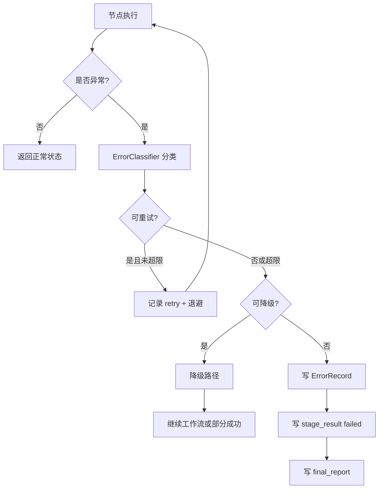
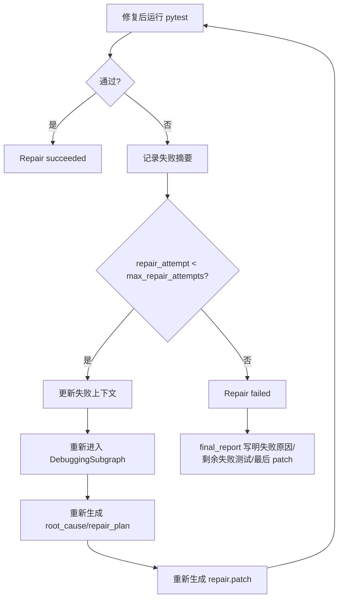
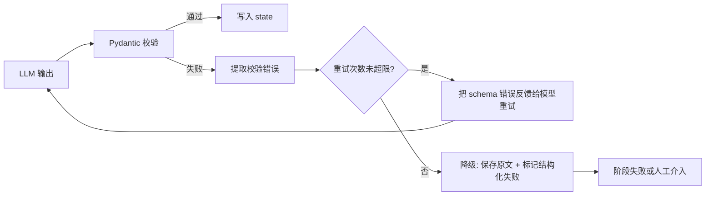

# 07 错误处理与重试设计

## 1. 设计目标

错误处理与重试设计目标是保证系统“失败可解释、过程可追踪、能恢复则恢复、不能恢复则明确说明”。系统不保证每个任务都能实现或修复成功，但必须避免无提示崩溃和误报成功。

## 2. 错误分类

| 类型 | 示例 | 处理策略 |
|---|---|---|
| 配置错误 | 阶段不连续、缺少项目路径、测试命令为空 | 执行前阻止，提示用户修正 |
| 路径错误 | 文件不存在、目录不可读、越界路径 | 阻止工具执行，返回明确错误 |
| 模型调用错误 | API Key 缺失、超时、限流、模型返回无效 JSON | 节点重试，超过次数后降级或失败 |
| 结构化输出错误 | Pydantic 校验失败、缺字段 | 带错误信息重试模型调用 |
| 工具执行错误 | read_file 失败、patch 格式错误、shell 超时 | 工具级错误记录，允许 Agent 换策略 |
| pytest 失败 | 测试用例失败、断言失败 | 不是系统异常；作为调试/修复输入 |
| patch 应用失败 | patch 冲突、目标文件不存在 | 返回生成节点重新生成 patch |
| HITL 取消 | 用户 cancel 或拒绝关键动作 | 停止或回退，写 cancelled/failed 报告 |
| 修复失败 | 修复后测试仍失败 | 多轮闭环，达到上限后失败报告 |
| checkpoint 恢复失败 | run_id 不存在、SQLite 损坏 | 尝试读取产物目录；无法恢复则提示无法 resume |

## 3. 节点级重试策略

| 节点类型 | 默认重试 | 说明 |
|---|---:|---|
| LLM 计划生成 | 2 | API 超时/结构化校验失败可重试 |
| LLM patch 生成 | 2 | 第二次重试附加 patch 校验错误 |
| 文件读取/搜索 | 0-1 | 路径错误通常不重试；短暂 IO 错误可重试 |
| patch 校验 | 0 | 校验失败回到 patch 生成节点 |
| patch 应用 | 0 | 不自动重试，避免重复副作用；回到生成节点 |
| shell 执行 | 0 | pytest 失败不是异常；超时按失败记录 |
| pytest 解析 | 1 | 解析失败可用兜底正则摘要 |
| 报告写入 | 1 | IO 短暂错误可重试 |

## 4. 错误处理流程



## 5. pytest 失败与系统失败的区别

| 情况 | 分类 | 路由 |
|---|---|---|
| `pytest` exit_code != 0，解析到失败用例 | 业务失败 | 若包含 debug，进入调试；否则 final failed |
| `pytest` 命令不存在 | 环境/配置错误 | 提示安装或修改命令，阶段失败 |
| `pytest` 超时 | 工具执行错误/可能业务卡死 | 保存日志；若包含 debug，可进入调试但标记超时 |
| 测试全部通过 | 业务成功 | 跳过 debug/repair，写成功报告 |
| 用户拒绝执行 pytest | HITL 决策 | 标记测试未执行；若进入调试则置信度低 |

## 6. 多轮修复闭环



默认参数：

```yaml
max_repair_attempts: 3
model_max_retries: 2
command_timeout_seconds: 120
log_truncation_chars: 12000
tool_call_limit_per_node: 12
```

## 7. 结构化输出校验失败处理



模型重试提示必须只包含 schema 错误摘要，不要求模型输出隐藏思维链。

## 8. checkpoint 与恢复策略

### 8.1 保存时机

| 时机 | 保存内容 |
|---|---|
| run 初始化 | TaskConfig、ProjectProfile、输出目录 |
| 每个节点结束 | 当前 state、产物路径、错误记录 |
| HITL interrupt 前 | 待审批 payload、上下文摘要 |
| HITL resume 后 | HumanDecision、后续路由 |
| 阶段结束 | StageResult、阶段产物索引 |
| final | FinalResult、artifacts_index |

### 8.2 恢复命令

```bash
codeagent resume --run-id 2026-06-02_implement-test-debug-repair_001
```

恢复流程：

1. 检查 `codeagent_runs/<run_id>/` 是否存在；
2. 读取 `task_config.yaml`；
3. 打开 `checkpoints.sqlite`；
4. 用 `thread_id=run_id` 恢复 graph state；
5. 若存在 pending interrupt，重新展示审批信息；
6. 若没有 pending interrupt，则从最近 checkpoint 继续或提示已完成。

## 9. 副作用幂等设计

有副作用节点必须使用 `operation_id`：

```text
operation_id = sha256(run_id + node_name + patch_path + approved_decision_id)
```

执行前检查：

| 工具 | 幂等检查 |
|---|---|
| `apply_patch` | `changed_files.json` 中是否已记录该 operation_id |
| `run_shell` | 是否已有同一 operation_id 的 stdout/stderr；默认可重新运行 pytest，但需记录新 attempt |
| `write_report` | 同路径已存在则覆盖前写 `.bak` 或记录版本 |
| `record_artifact` | artifact_id 去重 |

## 10. 错误记录结构

```python
class ErrorRecord(BaseModel):
    error_id: str
    stage: str
    node: str
    error_type: Literal[
        "config", "path", "model", "schema", "tool",
        "pytest_failure", "patch", "hitl", "checkpoint", "unknown"
    ]
    message: str
    retryable: bool
    retry_count: int
    timestamp: str
    artifact_paths: list[str] = []
    suggestion: str | None = None
```

## 11. 失败报告模板

阶段失败时必须写入：

```markdown
# 阶段失败报告

- 阶段：repair
- 节点：run_regression_tests
- 失败类型：pytest_failure
- 是否已重试：是，3/3
- 失败摘要：仍有 2 个测试失败
- 相关产物：
  - repair/after_test.log
  - debugging/fault_localization.json
  - repair/repair.patch.diff
- 系统已做操作：
  1. 生成修复计划
  2. 生成并应用补丁
  3. 运行 pytest 验证
- 建议人工检查：
  - src/calculator.py: add
  - tests/test_calculator.py::test_add_negative
```

## 12. 降级策略

| 失败点 | 降级方案 |
|---|---|
| 无法生成结构化测试方案 | 保存模型原文，要求用户修改或重试 |
| pytest 解析失败 | 使用 stdout/stderr 关键行摘要，标记 parse_confidence=low |
| 无法自动复现 | 进入静态日志分析路径，根因置信度降低 |
| repair patch 校验失败 | 回到 Repairer，附加校验错误重新生成 |
| checkpoint 恢复失败 | 读取 artifact index 和 stage_result，生成只读恢复摘要 |
| 模型调用持续失败 | 写阶段失败报告，保留已完成产物 |

## 13. 用户取消处理

用户在任何审批点选择 `cancel`：

1. `state.status = cancelled`；
2. 写入 `HumanDecision`；
3. 写入当前阶段 `stage_result.json`；
4. 不执行后续副作用节点；
5. 写 `final_report.md`，说明用户取消的位置和已生成产物。
