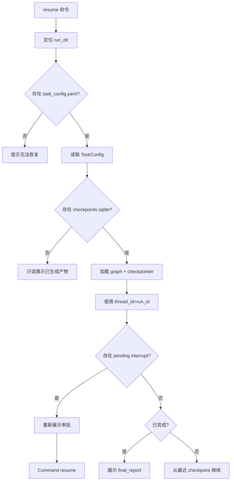

# 09 运行产物与可复现设计

## 1. 设计目标

运行产物设计服务于课程验收和开发调试。每次运行必须做到：

1. 有唯一 `run_id`；
2. 输入配置可复现；
3. 阶段产物可检查；
4. patch、日志、报告可追踪；
5. 人工审批和路由决策可审计；
6. 中断后可以通过 `resume` 恢复或至少查看中断前状态。

## 2. 输出目录结构

```text
codeagent_runs/
└── <run_id>/
    ├── metadata.json
    ├── task_config.yaml
    ├── checkpoints.sqlite
    ├── transcript.jsonl
    ├── decision_trace.jsonl
    ├── artifacts_index.json
    ├── implementation/
    │   ├── implementation_plan.md
    │   ├── patch.diff
    │   ├── changed_files.json
    │   ├── build.log
    │   ├── implementation_report.md
    │   └── stage_result.json
    ├── testing/
    │   ├── test_plan.md
    │   ├── test_plan_review.json
    │   ├── test_patch.diff
    │   ├── test_stdout.log
    │   ├── test_stderr.log
    │   ├── test_report.json
    │   ├── test_report.md
    │   └── stage_result.json
    ├── debugging/
    │   ├── reproduction_report.md
    │   ├── failure_summary.md
    │   ├── fault_localization.json
    │   ├── root_cause.md
    │   ├── repair_plan.md
    │   ├── debug_trace.jsonl
    │   ├── debug_report.md
    │   └── stage_result.json
    ├── repair/
    │   ├── repair_plan.final.md
    │   ├── repair.patch.diff
    │   ├── before_test.log
    │   ├── after_test.log
    │   ├── changed_files.json
    │   ├── repair_report.md
    │   └── stage_result.json
    ├── benchmark/
    │   ├── benchmark_result.json
    │   └── benchmark_report.md
    └── final_report.md
```

## 3. run_id 设计

格式建议：

```text
YYYY-MM-DD_HHMMSS_<stages>_<short_hash>
```

示例：

```text
2026-06-02_153012_implement-test-debug-repair_a1b2c3
```

`short_hash` 可由项目路径、阶段列表、时间戳生成，避免同名覆盖。

## 4. metadata.json

```json
{
  "run_id": "2026-06-02_153012_implement-test-debug-repair_a1b2c3",
  "created_at": "2026-06-02T15:30:12+08:00",
  "mode": "run",
  "stages": ["implement", "test", "debug", "repair"],
  "project_path": "./examples/login_project",
  "output_dir": "./codeagent_runs/2026-06-02_153012_implement-test-debug-repair_a1b2c3",
  "language": "python",
  "test_framework": "pytest",
  "test_command": "pytest -q",
  "model": {
    "provider": "openai_compatible",
    "model_name": "google/gemini-3.5-flash",
    "base_url": "https://openrouter.ai/api/v1",
    "api_key_env": "OPENROUTER_API_KEY"
  },
  "checkpoint": {
    "type": "sqlite",
    "path": "checkpoints.sqlite",
    "thread_id": "2026-06-02_153012_implement-test-debug-repair_a1b2c3"
  }
}
```

## 5. transcript.jsonl

`transcript.jsonl` 保存可审计过程，不保存隐藏思维链。

事件类型：

| type | 内容 |
|---|---|
| `user_input` | 用户配置、审批输入摘要 |
| `agent_message` | 模型可见输出摘要 |
| `structured_output` | 计划、测试方案、故障定位、修复计划等结构化结果 |
| `tool_call` | 工具名、参数摘要、状态、产物路径 |
| `tool_result` | 工具结果摘要、错误信息 |
| `stage_result` | 阶段结束状态 |

示例：

```json
{"type":"tool_call","stage":"testing","tool_name":"run_shell","args_summary":{"command":"pytest -q"},"timestamp":"2026-06-02T15:35:00+08:00"}
{"type":"tool_result","stage":"testing","tool_name":"run_shell","status":"succeeded","summary":"18 passed, 2 failed","artifact_paths":["testing/test_stdout.log","testing/test_stderr.log"]}
```

## 6. decision_trace.jsonl

`decision_trace.jsonl` 保存人工审批和系统路由决策。

事件类型：

| type | 内容 |
|---|---|
| `human_decision` | approve/edit/reject/respond/cancel |
| `route_decision` | 条件边选择和理由 |
| `retry_decision` | 是否重试、原因、次数 |
| `risk_decision` | patch 风险判定 |
| `skip_decision` | 跳过某阶段或某动作的原因 |

示例：

```json
{"type":"route_decision","from":"testing","to":"debugging","reason":"pytest failed and debug stage is selected","failed":2}
{"type":"human_decision","action":"approve_repair_patch","decision_type":"approve","payload_summary":"modify src/calculator.py only"}
```

## 7. artifacts_index.json

```json
{
  "run_id": "...",
  "artifacts": [
    {
      "artifact_id": "implementation_plan",
      "stage": "implementation",
      "kind": "report",
      "path": "implementation/implementation_plan.md",
      "summary": "实现登录功能，修改 src/auth.py 和 src/models.py"
    },
    {
      "artifact_id": "repair_patch_1",
      "stage": "repair",
      "kind": "patch",
      "path": "repair/repair.patch.diff",
      "summary": "修复 None 输入导致的 TypeError"
    }
  ]
}
```

规则：

1. 每个产物创建后必须登记；
2. 报告中引用产物必须来自 artifact index；
3. 删除或覆盖产物时必须更新索引；
4. benchmark 聚合时只读取 index 和 stage_result。

## 8. stage_result.json

统一结构：

```json
{
  "stage": "testing",
  "status": "failed",
  "started_at": "2026-06-02T15:33:00+08:00",
  "ended_at": "2026-06-02T15:36:00+08:00",
  "summary": "pytest 执行完成：18 passed, 2 failed",
  "artifacts": [
    "testing/test_plan.md",
    "testing/test_report.json",
    "testing/test_stdout.log"
  ],
  "failure_reason": "2 个测试失败，进入调试阶段",
  "next_suggestion": "读取 debugging/failure_summary.md"
}
```

## 9. 阶段报告模板

### 9.1 implementation_report.md

```markdown
# 实现阶段报告

## 实现目标

## 输入材料

## 实现计划摘要

## 修改文件

## 验收条件映射

## 语法/构建检查结果

## 已知限制

## 产物列表
```

### 9.2 test_report.md

```markdown
# 测试阶段报告

## 测试方案摘要

## 人工审核结果

## 新增/修改测试文件

## 执行命令

## 测试结果

## 失败摘要

## 后续路由
```

### 9.3 debug_report.md

```markdown
# 调试阶段报告

## 复现情况

## 失败测试摘要

## 可疑位置排序

## 根因分析

## 修复建议

## 置信度和风险
```

### 9.4 repair_report.md

```markdown
# 修复阶段报告

## 修复计划

## 修复补丁摘要

## 人工审批记录

## 修改文件

## 修复后验证结果

## 回归风险

## 是否成功
```

### 9.5 final_report.md

```markdown
# 智能体运行总结报告

## 任务摘要

## 阶段结果总览

| 阶段 | 状态 | 关键产物 | 说明 |
|---|---|---|---|

## 代码变更摘要

## 测试结果摘要

## 调试与修复摘要

## 人工审批记录摘要

## 失败原因或限制

## 输出产物索引
```

## 10. resume 设计

### 10.1 resume 输入

```bash
codeagent resume --run-id <run_id>
```

### 10.2 resume 流程



## 11. 可复现性规则

1. `task_config.yaml` 必须保存规范化后的最终配置；
2. `metadata.json` 必须记录模型名、base_url、环境变量名，但不记录 API Key 明文；
3. `transcript.jsonl` 和 `decision_trace.jsonl` 必须足以解释主要过程；
4. pytest stdout/stderr 必须落盘；
5. patch 必须落盘；
6. benchmark 运行必须保存每个 case 的 run_id；
7. final_report 不能包含未落盘或无法追溯的产物。

## 12. 敏感信息处理

| 内容 | 策略 |
|---|---|
| API Key | 只记录 env 名，不记录值 |
| `.env` 文件 | 默认不读取、不上传模型、不进入 transcript |
| 私钥/证书 | 默认跳过 |
| 用户代码 | 可能发送给模型，首次运行应提示用户 |
| transcript | 默认本地保存，不上传 |
| benchmark | 保存配置和结果，不保存敏感输入明文 |
