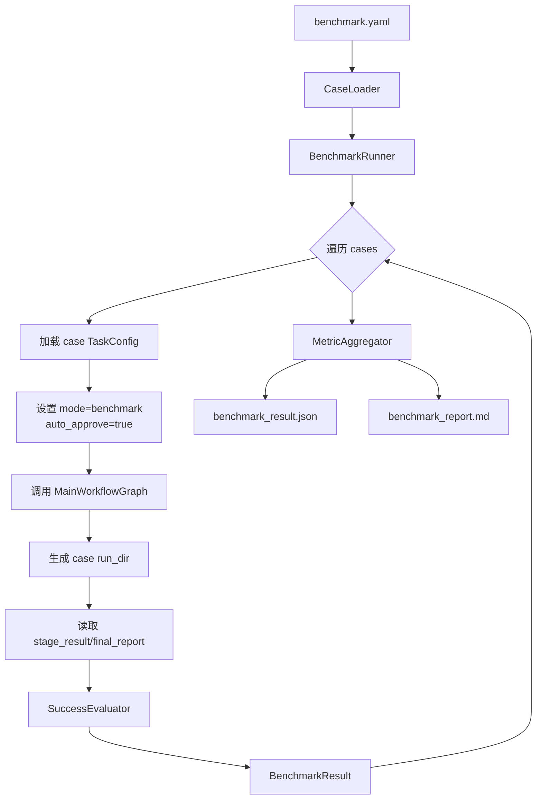
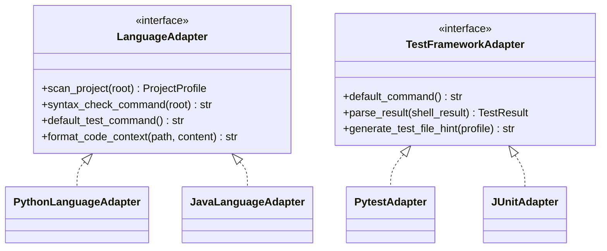

# 10 Benchmark 与扩展预留设计

## 1. 设计边界

本文档只设计 Benchmark 模块的系统结构、配置格式和运行机制，不展开课程“测试方案与测试报告”中的具体测试用例设计。

用户决策为：Benchmark 不限于 5 个，建议设计 6 个案例：

```text
实现 + 测试类：2 个
调试 + 修复类：2 个
全流程类：2 个
```

## 2. Benchmark 模块目标

1. 支持通过 `benchmark.yaml` 批量执行多个任务；
2. 每个 case 复用普通 `TaskConfig` 和主工作流；
3. benchmark 模式允许自动审批测试命令和 patch，但必须记录自动审批；
4. 每个 case 独立输出 run_dir；
5. 聚合成功率、失败原因和产物路径；
6. 支持按类别统计：implement_test、debug_repair、full_pipeline。

## 3. Benchmark 运行架构



## 4. benchmark.yaml 设计

```yaml
benchmark_id: codeagent_course_benchmark_v1
name: 基于大语言模型的软件工程智能体 Benchmark
output_dir: ./codeagent_runs/benchmark

model:
  provider: openai_compatible
  model_name: anthropic/claude-opus-4.8
  base_url: https://openrouter.ai/api/v1
  api_key_env: OPENROUTER_API_KEY
  temperature: 0.2

runtime:
  auto_approve_in_benchmark: true
  max_repair_attempts: 3
  command_timeout_seconds: 120

cases:
  - case_id: impl_test_001
    category: implement_test
    description: 根据需求实现纯函数并生成 pytest
    task_config: ./benchmarks/impl_test_001/task.yaml
    expected_artifacts:
      - implementation/implementation_report.md
      - testing/test_report.json
    success_criteria:
      pytest_pass: true
      required_stage_status:
        implementation: succeeded
        testing: succeeded

  - case_id: debug_repair_001
    category: debug_repair
    description: 给定失败测试和 buggy 函数，定位并修复
    task_config: ./benchmarks/debug_repair_001/task.yaml
    success_criteria:
      pytest_pass: true
      required_stage_status:
        debugging: succeeded
        repair: succeeded

  - case_id: full_pipeline_001
    category: full_pipeline
    description: 从需求到实现、测试、失败调试和修复的完整流程
    task_config: ./benchmarks/full_pipeline_001/task.yaml
    success_criteria:
      pytest_pass: true
      required_stage_status:
        implementation: succeeded
        testing: succeeded
```

## 5. Case TaskConfig 约定

每个 case 目录建议包含：

```text
benchmarks/
└── impl_test_001/
    ├── task.yaml
    ├── requirements.md
    ├── acceptance.md
    └── project/
        ├── src/
        └── tests/
```

`task.yaml` 示例：

```yaml
task_id: impl_test_001
stages: [implement, test]
project_path: ./project
language: python
test_framework: pytest
test_command: pytest -q
input_materials:
  - material_type: requirements
    path: ./requirements.md
    required: true
  - material_type: acceptance
    path: ./acceptance.md
    required: false
```

## 6. 成功判定接口

```python
class SuccessCriteria(BaseModel):
    pytest_pass: bool = True
    required_stage_status: dict[str, Literal["succeeded", "failed", "skipped"]] = {}
    required_artifacts: list[str] = []
    forbidden_patch_patterns: list[str] = []

class SuccessEvaluator(Protocol):
    def evaluate(self, run_dir: Path, criteria: SuccessCriteria) -> CaseEvaluation: ...
```

判定规则：

| 规则 | 说明 |
|---|---|
| pytest_pass | 若要求为 true，则读取最终 test/repair pytest 结果必须通过 |
| required_stage_status | 指定阶段必须达到要求状态 |
| required_artifacts | 产物必须存在且登记在 artifacts_index |
| forbidden_patch_patterns | patch 不得包含删除测试、skip 断言等模式 |
| no_unhandled_exception | final_report 不得显示系统异常崩溃 |

## 7. BenchmarkResult 结构

```python
class CaseEvaluation(BaseModel):
    case_id: str
    category: str
    success: bool
    score: float
    duration_seconds: float
    run_id: str
    run_dir: Path
    final_report_path: Path | None = None
    failure_reason: str | None = None
    stage_status: dict[str, str]
    metrics: dict[str, Any] = {}

class BenchmarkResult(BaseModel):
    benchmark_id: str
    total_cases: int
    success_cases: int
    success_rate: float
    by_category: dict[str, dict]
    cases: list[CaseEvaluation]
```

## 8. benchmark_report.md 模板

```markdown
# Benchmark 运行报告

## 1. 总览

- Benchmark ID:
- 模型：
- 总案例数：
- 成功案例数：
- 成功率：

## 2. 分类结果

| 分类 | 数量 | 成功 | 成功率 |
|---|---:|---:|---:|

## 3. 案例明细

| Case ID | 分类 | 成功 | 运行目录 | 失败原因 |
|---|---|---|---|---|

## 4. 失败原因聚合

## 5. 局限性说明
```

## 9. 自动审批策略

Benchmark 模式为了批量运行，可以启用自动审批，但必须记录：

```json
{
  "type": "human_decision",
  "action": "approve_test_command",
  "decision_type": "approve",
  "auto": true,
  "reason": "benchmark mode auto approval enabled"
}
```

自动审批范围：

| 动作 | benchmark 默认 |
|---|---|
| 测试方案 | 自动 approve |
| 测试 patch | 自动 approve |
| 实现 patch | 自动 approve |
| 修复 patch | 自动 approve，但仍做 patch 风险检查 |
| pytest 命令 | 自动 approve |
| 非 pytest shell 命令 | 不自动 approve，除非 case 明确 allow |

## 10. Java 扩展预留

MVP 不支持 Java，但保留接口：



Java 后续扩展需要补充：

| 能力 | Python MVP | Java 扩展 |
|---|---|---|
| 项目扫描 | `pyproject.toml`、`requirements.txt`、`src/`、`tests/` | `pom.xml`、`build.gradle`、`src/main/java`、`src/test/java` |
| 语法/构建 | `python -m py_compile` | `mvn test` / `gradle test` |
| 测试解析 | pytest stdout | JUnit XML / Maven Surefire report |
| 测试生成 | pytest 函数 | JUnit 测试类 |
| 修复验证 | `pytest -q` | `mvn test` 或 `gradle test` |

## 11. 其他扩展点

| 扩展点 | 当前设计 | 后续扩展 |
|---|---|---|
| 模型供应商 | OpenAI-compatible | Anthropic SDK、Ollama、本地模型 |
| 测试框架 | pytest | unittest、JUnit、Vitest |
| 阶段 | 实现/测试/调试/修复 | 需求分析、系统设计、文档生成 |
| 报告 | Markdown/JSON | HTML、PDF |
| 安全 | 路径限制 + HITL | 容器沙箱、只读挂载、命令白名单 |
| 观测 | transcript/decision_trace | LangSmith tracing 可选集成 |
| IDE | 不支持 | VSCode Task 调 CLI，但不作为核心设计 |

## 12. 不考虑 Git 的替代设计

由于完全不考虑 Git 工作区检查，Benchmark 和普通运行都使用以下方式保证可检查：

1. patch 文件记录所有变更；
2. changed_files.json 记录应用后的文件列表；
3. artifact index 记录 patch 路径；
4. 不执行 git status；
5. 不要求项目是 Git 仓库；
6. 不自动 commit。

## 13. Benchmark 风险控制

| 风险 | 控制 |
|---|---|
| 自动审批导致危险命令执行 | benchmark 默认只允许 pytest/py_compile 类命令 |
| case 互相污染 | 每个 case 使用独立项目副本和独立 run_dir |
| 修复过拟合 | patch risk checker 检查删除测试、skip、硬编码 |
| 成功率不可解释 | 每个失败 case 保存 final_report 和 failure_reason |
| 结果不可复现 | 保存 task_config、metadata、模型配置、日志和 patch |
