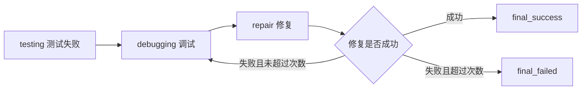

# Todo Manager 任务中的 Agent 完整工作流程讲解

本文基于一次真实半交互运行产物编写，目标是回答两个问题：

1. 终端里看到的每一段日志到底代表 Agent 在做什么。
2. `codeagent_runs\interactive_demo\todo_manager` 里的每个文件或目录是由哪一步产生、应该怎么看。

本次成功运行的 run directory 是：

```text
codeagent_runs\interactive_demo\todo_manager\runs\2026-06-03_164411_134073_implement-test-debug-repair_5a9843
```

> 版本说明：本文分析的是 2026-06-03 的一次历史 run。后续 OPT01 优化已经修正了审批记录语义、implementation/testing 解耦和完整 workflow 追踪日志。OPT02 又进一步修正了人工审批体验：计划审批只保留“同意”和“不同意并提出修改意见，重新生成”两个选项；补丁和命令审批仍保留更完整的风险控制选项。新 run 会额外生成 `workflow.log`、`workflow_events.jsonl`，并在 `decision_trace.jsonl` 中记录 `decision_source`、`presented_to_user`、`event_type=approval_decision`。因此，旧 run 中的 `"auto": false, "type": "human_decision"` 只能理解为旧 schema 的审批决策记录，不能证明用户当时真的收到了人工审批提示。

## 1. 先看整体结论

这次历史任务的输入曾是 `requirements.md`，要求 Agent 从空 `workspace/` 生成一个命令行待办事项管理软件。当前 Todo Manager benchmark 已升级为 `PRD.md`、`user_stories.md`、`design_model.md`、`acceptance_criteria.md` 四份中文材料，并要求默认启动简单 TUI。本文后续仍保留对旧 run 的过程解释。

- Agent 在实现阶段生成了 `todo_manager` Python 包。
- Agent 在测试阶段生成并运行了自测文件 `tests/test_todo.py`。
- 自测结果为 `20 passed, 0 failed, 0 errors, 0 skipped`。
- 因为测试通过，系统没有进入调试阶段和修复阶段。
- 最终状态为 `succeeded`。

生成的软件位于：

```text
codeagent_runs\interactive_demo\todo_manager\workspace
```

运行报告位于：

```text
codeagent_runs\interactive_demo\todo_manager\runs\2026-06-03_164411_134073_implement-test-debug-repair_5a9843
```

## 2. 这次任务的输入是什么

演示前执行了这几行命令：

```powershell
$todoDemo = "codeagent_runs\interactive_demo\todo_manager"
Remove-Item -LiteralPath $todoDemo -Recurse -Force -ErrorAction SilentlyContinue
New-Item -ItemType Directory -Path "$todoDemo\workspace" -Force | Out-Null
New-Item -ItemType Directory -Path "$todoDemo\input" -Force | Out-Null
Copy-Item -LiteralPath benchmark\selfbuilt\cases\01_todo_manager\input\PRD.md -Destination "$todoDemo\input\PRD.md"
Copy-Item -LiteralPath benchmark\selfbuilt\cases\01_todo_manager\input\user_stories.md -Destination "$todoDemo\input\user_stories.md"
Copy-Item -LiteralPath benchmark\selfbuilt\cases\01_todo_manager\input\design_model.md -Destination "$todoDemo\input\design_model.md"
Copy-Item -LiteralPath benchmark\selfbuilt\cases\01_todo_manager\input\acceptance_criteria.md -Destination "$todoDemo\input\acceptance_criteria.md"
```

这一步的含义是：

- 删除旧的演示副本，避免旧代码影响本次演示。
- 创建一个空的 `workspace/`，模拟用户自己的空项目目录。
- 复制四份公开输入材料到 `input/`：`PRD.md`、`user_stories.md`、`design_model.md`、`acceptance_criteria.md`。
- 不修改 benchmark 原始 case。

这些材料描述了要生成的软件：

- 使用 Python 3.11+。
- 只允许使用标准库。
- 入口是 `python -m todo_manager`。
- 数据保存到 JSON 文件。
- 默认启动简单文本 TUI，让用户在同一个会话中添加、查看、完成、删除任务。
- 需要处理空标题、非法日期、非法优先级、错误 JSON、任务不存在等异常。
- Agent 需要自己创建包目录、代码、入口和必要测试。

换句话说，Agent 不是在补全一个已有项目，而是从空目录开始生成完整软件。

## 3. 终端日志中第一次失败是什么

截图中第一次运行 `codeagent wizard` 后，在输入项目目录之后出现：

```text
向导输入无效: Cannot use j/k keys with prefix filter search, since j/k can be part of the prefix.
```

这不是 Agent 失败，也不是 LLM 失败，而是半交互表单控件的一个前端交互配置错误：

- 输入材料多选列表启用了“输入文字搜索”。
- 同时控件默认启用了 `j/k` 作为上下移动快捷键。
- 这两个功能冲突，因为搜索时输入 `j` 或 `k` 应该作为搜索字符。
- 控件因此直接报错退出。

这次失败发生在真正启动 Agent 之前，所以不会产生业务代码，也不会产生本次成功 run directory。

随后重新运行 `codeagent wizard`，第二次进入了正常流程，后续产物都来自第二次成功运行。

## 4. wizard 做了什么

`codeagent wizard` 是半交互入口。它不是直接让 LLM 开始写代码，而是先把用户填写的表单转换成标准任务配置。

你在表单里选择或填写了：

```text
阶段组合：完整流水线：实现 + 测试 + 调试 + 修复
项目目录：codeagent_runs\interactive_demo\todo_manager\workspace
输入材料：PRD.md、user_stories.md、design_model.md、acceptance_criteria.md
输出目录：codeagent_runs\interactive_demo\todo_manager\runs
测试命令：python -m pytest -q
```

wizard 确认后生成的标准配置保存在：

```text
runs\<run_id>\task_config.yaml
```

这份配置说明本次运行使用：

- `mode: wizard`
- `stages: implement, test, debug, repair`
- `project_path`: 生成软件的工作区
- `input_materials`: 公开需求文档
- `model_name: anthropic/claude-sonnet-4.6`
- `base_url: https://openrouter.ai/api/v1`
- `api_key_env: OPENROUTER_API_KEY`
- `test_command: python -m pytest -q`
- `checkpoint: sqlite`

重点是：wizard 确认后会直接启动 Agent，不需要再手动运行 `codeagent run --config`。

## 5. Agent 的主状态图如何转移

本项目使用 LangGraph 组织 Agent 工作流。对这次 Todo Manager 任务来说，实际经过的主路径是：


虽然你选择了完整流水线 `implement, test, debug, repair`，但调试和修复不是无条件执行。它们只在测试失败时才有意义。

本次关键路由判断是：

1. `route_entry`
   - 查看 `selected_stages` 的第一个阶段。
   - 第一个阶段是 `implement`。
   - 所以进入 `implementation`。

2. `route_after_implementation`
   - 查看实现阶段结果。
   - 实现阶段状态是 `succeeded`。
   - 配置中包含 `test` 阶段。
   - 所以进入 `testing`。

3. `route_after_testing`
   - 查看测试阶段结果。
   - 测试阶段状态是 `succeeded`。
   - 因为测试已经通过，所以跳过后面的 `debug` 和 `repair`。
   - 进入 `final_success`。

如果测试失败，状态图会改走：



所以这次没有 `debugging/` 和 `repair/` 目录，是正常现象，不是缺少产物。

## 6. AgentState 中保存了什么

Agent 每走一步，都会更新一份状态。核心字段可以理解为：

| 字段 | 含义 | 本次任务中的作用 |
|---|---|---|
| `run_id` | 本次运行 ID | 对应目录名 `2026-06-03_164411_...` |
| `mode` | 运行入口 | 本次为 `wizard` |
| `selected_stages` | 用户选择的阶段 | `implement, test, debug, repair` |
| `current_stage` | 当前阶段 | 运行中会变为 `implementation`、`testing` |
| `current_node` | 当前图节点 | 如 `route_entry`、`implementation`、`testing` |
| `stage_results` | 各阶段结果 | 保存实现和测试是否成功、产物 ID |
| `decision_trace` | 审批和决策记录 | 保存补丁、测试计划、测试命令等审批 |
| `pending_interrupt` | 等待审批的动作 | 如待审批 patch 或命令 |
| `error` | 当前错误 | 本次成功运行最终为空 |
| `final_status` | 最终状态 | 本次为 `succeeded` |
| `repair_attempt` | 修复次数 | 本次没有进入 repair，保持 0 |

这些状态会通过 SQLite checkpoint 保存，checkpoint 文件是：

```text
runs\<run_id>\checkpoints.sqlite
```

它的作用是让系统可以恢复运行，而不是每次失败都从头开始。

## 7. 实现阶段做了什么

终端中实现阶段大致是这些日志：

```text
[实现阶段] 正在读取公开需求和可见源码，准备生成实现计划
[实现阶段] 正在调用 LLM 生成 ImplementationPlan（第 1/3 次）
[Agent] 模型正在生成结构化输出
[实现阶段] LLM 已生成有效的 ImplementationPlan
[实现阶段] 已获得实现计划，正在生成、校验并应用实现补丁
[结果] 实现阶段 成功: Implementation patch applied and syntax check completed.
```

逐步解释如下。

### 7.1 读取需求和可见源码

Agent 首先读取：

```text
codeagent_runs\interactive_demo\todo_manager\input\PRD.md
codeagent_runs\interactive_demo\todo_manager\input\user_stories.md
codeagent_runs\interactive_demo\todo_manager\input\design_model.md
codeagent_runs\interactive_demo\todo_manager\input\acceptance_criteria.md
codeagent_runs\interactive_demo\todo_manager\workspace
```

当前新版演示应改为读取 `input\PRD.md`、`input\user_stories.md`、`input\design_model.md`、`input\acceptance_criteria.md` 和空 `workspace/`。旧 run 中 `workspace/` 是空的，所以 Agent 看到的是“只有需求，没有代码”。

### 7.2 调用 LLM 生成实现计划

系统向 OpenRouter 上的模型请求一个结构化 `ImplementationPlan`。这里的“第 1/3 次”表示最多允许 3 次尝试：

- 如果模型输出不符合 schema，系统会要求重试。
- 如果输出符合 schema，就进入下一步。

本次实现计划第 1 次就有效，对应产物：

```text
runs\<run_id>\implementation\plan_generation_attempts.json
runs\<run_id>\implementation\implementation_plan.md
```

`implementation_plan.md` 里可以看到模型计划创建这些文件：

- `todo_manager/__init__.py`
- `todo_manager/models.py`
- `todo_manager/storage.py`
- `todo_manager/cli.py`
- `todo_manager/__main__.py`
- `tests/test_todo.py`

注意：这是历史 run 暴露出的阶段职责问题。OPT01 之后，implementation 阶段已经禁止生成 `tests/`、`test_*.py` 等测试产物；测试文件应由 testing 阶段单独生成和运行。

### 7.3 生成 patch，而不是直接写文件

Agent 不直接随意写文件，而是先生成 unified diff patch。

本次实现 patch 保存为：

```text
runs\<run_id>\implementation\implementation_attempt_1.patch.diff
runs\<run_id>\implementation\implementation.patch.diff
```

其中：

- `implementation_attempt_1.patch.diff` 是第 1 次生成的原始实现补丁。
- `implementation.patch.diff` 是最终被接受并用于应用的实现补丁。

这份 patch 从 `/dev/null` 创建新文件，说明它是在空项目里新增文件。

### 7.4 校验 patch

系统检查 patch 是否可以应用、改了哪些文件、风险等级是什么。结果保存在：

```text
runs\<run_id>\implementation\patch_attempts.json
```

本次结果：

```text
attempt: 1
status: valid
risk_level: high
changed_files:
- todo_manager/__init__.py
- todo_manager/models.py
- todo_manager/storage.py
- todo_manager/cli.py
- todo_manager/__main__.py
- tests/test_todo.py
```

这里风险等级是 `high`，不是说代码一定危险，而是因为它批量创建了多个业务文件和测试文件，变更范围较大，需要审计。

### 7.5 审批并应用 patch

审批记录保存在：

```text
runs\<run_id>\decision_trace.jsonl
```

其中实现阶段有一条：

```text
approve_implementation_patch
decision_type: approve
```

这表示实现补丁通过审批，然后系统把 patch 应用到 `workspace/`。

应用后，工作区出现了真正的软件代码。

### 7.6 语法检查

实现 patch 应用后，系统对 Python 文件做语法检查。结果保存在：

```text
runs\<run_id>\implementation\syntax_check.log
```

本次结果：

```text
exit_code: 0
Checked 6 Python file(s).
```

说明生成的 Python 文件可以被解析，没有语法错误。

### 7.7 写入实现阶段报告

实现阶段最后写入：

```text
runs\<run_id>\implementation\stage_result.json
runs\<run_id>\implementation\stage_report.md
runs\<run_id>\implementation\implementation_report.md
runs\<run_id>\implementation\changed_files.json
```

`stage_result.json` 是机器可读结果，状态为：

```text
status: succeeded
summary: Implementation patch applied and syntax check completed.
```

此时 AgentState 中的 `stage_results["implementation"]` 被更新为成功。

## 8. 测试阶段做了什么

实现阶段成功后，路由进入测试阶段。终端中关键日志是：

```text
[测试阶段] 正在根据公开需求、实现产物和可见源码设计自测用例
[测试阶段] 正在调用 LLM 生成 TestingPlan（第 1/3 次）
[测试阶段] 正在调用 LLM 生成 TestingPlan（第 2/3 次）
[测试阶段] LLM 已生成有效的 TestingPlan
[测试阶段] 测试方案已生成，正在写入测试补丁并执行 Agent 自测
[工具] apply_patch: 已应用
[工具] run_shell: 正在执行 Agent 自测命令: python -m pytest -q tests/test_todo.py
[测试结果] 20 passed, 0 failed, 0 errors, 0 skipped（total=20）
```

### 8.1 读取需求、代码和实现产物

测试阶段不会凭空写测试。它会读取：

- 原始输入材料。旧 run 是 `requirements.md`；新版 Todo case 是四份中文材料：`PRD.md`、`user_stories.md`、`design_model.md`、`acceptance_criteria.md`
- 当前 `workspace/` 中的实现代码
- 实现阶段产生的计划、patch、changed files 等产物

目标是根据公开信息设计 Agent 自己的测试。

### 8.2 调用 LLM 生成 TestingPlan

这次测试计划经历了两次尝试：

```text
attempt 1: invalid
attempt 2: valid
```

记录在：

```text
runs\<run_id>\testing\plan_generation_attempts.json
```

第一次失败原因是：

```text
testing plan target is not a test path: conftest.py
```

这说明系统没有盲目信任 LLM 输出。LLM 第一次给出的测试目标不符合规则，系统拒绝并重试。第二次输出符合 `TestingPlan` schema，于是继续。

有效测试计划保存为：

```text
runs\<run_id>\testing\test_plan.json
runs\<run_id>\testing\test_plan.md
```

`test_plan.md` 里列出了 20 条验收测试，包括：

- 添加任务。
- 默认优先级。
- ID 递增。
- 空标题失败。
- 日期格式错误失败。
- 查看空任务。
- 按 open/done 过滤。
- 完成任务。
- 删除任务。
- 任务不存在时报错。
- JSON 文件损坏时报错。
- JSON 保存使用两个空格缩进并保留中文字符。

### 8.3 生成测试 patch

测试阶段也采用 patch-first。测试补丁保存在：

```text
runs\<run_id>\testing\test_patch_attempt_1.diff
runs\<run_id>\testing\test.patch.diff
```

这份 patch 修改了：

```text
workspace\tests\test_todo.py
```

变更列表保存在：

```text
runs\<run_id>\testing\changed_files.json
```

内容是：

```text
tests/test_todo.py
```

### 8.4 审批测试计划、测试 patch 和测试命令

测试阶段有三类可审计动作：

1. 审批测试计划。
2. 审批测试补丁。
3. 审批测试命令。

在当前版本中，第 1 类“计划审批”只提供两个选择：同意当前计划，或不同意并输入修改意见让 Agent 重新生成计划。它不是终止运行的按钮。第 2、3 类会实际修改文件或执行命令，因此仍是风险审批，保留拒绝、取消等选项。

它们都记录在：

```text
runs\<run_id>\decision_trace.jsonl
```

本次包含：

```text
review_test_plan -> approve
approve_test_patch -> approve
approve_test_command -> approve
```

测试命令审批记录还单独保存为：

```text
runs\<run_id>\testing\test_command.json
```

内容说明实际执行命令是：

```text
python -m pytest -q tests/test_todo.py
```

注意：wizard 这次是自动批准这些动作，但仍然留下了记录。这样既能顺滑演示，又能审计“系统到底批准了什么”。

### 8.5 执行 Agent 自测

系统调用 shell，在工作区执行：

```powershell
python -m pytest -q tests/test_todo.py
```

命令运行目录是：

```text
codeagent_runs\interactive_demo\todo_manager\workspace
```

完整执行记录保存在：

```text
runs\<run_id>\testing\logs\testing_run_tests.command.json
```

标准输出保存在：

```text
runs\<run_id>\testing\logs\testing_run_tests.stdout.log
```

内容是：

```text
....................                                                     [100%]
20 passed in 0.75s
```

标准错误保存在：

```text
runs\<run_id>\testing\logs\testing_run_tests.stderr.log
```

本次为空，表示没有 stderr 输出。

### 8.6 解析测试结果

系统把 pytest 输出解析成结构化结果：

```text
runs\<run_id>\testing\test_result.json
```

核心字段是：

```text
success: true
passed: 20
failed: 0
errors: 0
skipped: 0
total: 20
command: python -m pytest -q tests/test_todo.py
exit_code: 0
```

这一点很重要：本次不是 `0 passed` 也算成功，而是真正执行了 20 个 Agent 自测。

### 8.7 写入测试阶段报告

测试阶段最终产物：

```text
runs\<run_id>\testing\stage_result.json
runs\<run_id>\testing\stage_report.md
runs\<run_id>\testing\test_report.md
```

`stage_result.json` 里状态为：

```text
status: succeeded
summary: 20 passed, 0 failed, 0 errors, 0 skipped
```

此时 AgentState 中的 `stage_results["testing"]` 被更新为成功。

## 9. 为什么没有进入调试和修复

你选择的阶段是：

```text
implement, test, debug, repair
```

但阶段选择不是“所有阶段都强制跑一遍”，而是“这些阶段在需要时可用”。

本次测试阶段成功，路由器在 `route_after_testing` 做出的判断是：

```text
testing succeeded; skip later debug/repair
```

所以直接进入：

```text
final_success
```

只有当测试失败时，系统才会进入调试：

- 调试阶段分析失败日志、失败测试和代码。
- 修复阶段生成 repair patch。
- 修复后重新回到测试或调试循环。

本次没有失败，所以没有必要生成 `debugging/` 和 `repair/` 目录。

## 10. 最终报告如何产生

当主图进入 `final_success` 后，系统写入最终报告：

```text
runs\<run_id>\final_report.md
```

最终报告汇总了两个真正执行过的阶段：

| 阶段 | 状态 | 说明 |
|---|---|---|
| implementation | succeeded | 实现 patch 已应用，语法检查通过 |
| testing | succeeded | 20 passed, 0 failed, 0 errors, 0 skipped |

同时它列出所有关键产物，并统计：

```text
decision_trace 事件数: 4
transcript 事件数: 2
```

## 11. 生成的软件代码如何理解

最终工作区是：

```text
codeagent_runs\interactive_demo\todo_manager\workspace
```

里面的核心文件如下。

### 11.1 `todo_manager/__init__.py`

包标记文件。它让 Python 把 `todo_manager/` 识别为一个包。

由实现阶段的 `implementation.patch.diff` 创建。

### 11.2 `todo_manager/__main__.py`

命令入口文件。因为有这个文件，才能运行：

```powershell
python -m todo_manager
```

它内部调用：

```python
from todo_manager.cli import main
```

由实现阶段创建。

### 11.3 `todo_manager/models.py`

定义任务数据模型：

- `Task` dataclass
- `VALID_PRIORITIES = ("low", "normal", "high")`
- `VALID_STATUSES = ("open", "done")`
- `to_dict()`
- `from_dict()`

它负责把内存中的任务对象和 JSON 字典互相转换。

由实现阶段创建。

### 11.4 `todo_manager/storage.py`

负责读写 JSON 文件：

- 文件不存在时返回空任务列表。
- JSON 非法时输出 `invalid task file` 并退出。
- 顶层不是数组时也认为文件非法。
- 保存时使用 `indent=2`。
- 保存时使用 `ensure_ascii=False`，因此中文不会被转义。

由实现阶段创建。

### 11.5 `todo_manager/cli.py`

实现命令行行为，是业务主文件：

- `parse_due()` 校验日期格式。
- `next_id()` 根据当前最大 ID 生成下一个 ID。
- `cmd_add()` 添加任务。
- `cmd_list()` 查看任务。
- `cmd_done()` 标记完成。
- `cmd_delete()` 删除任务。
- `build_parser()` 构建 argparse 命令行参数。
- `main()` 解析参数并分发命令。

由实现阶段创建。

### 11.6 `tests/test_todo.py`

这是 Agent 自己生成的测试文件，测试阶段最终执行的就是它：

```powershell
python -m pytest -q tests/test_todo.py
```

它覆盖 20 个用例，包括正常路径和异常路径。

这个文件有一个容易混淆的点：

- 实现阶段已经创建过一个 `tests/test_todo.py`。
- 测试阶段又根据 TestingPlan 对它进行了测试补丁更新。
- 最终工作区里看到的是测试阶段之后的版本。

所以它既是“生成软件的一部分”，也是“Agent 自测产物”。

### 11.7 `__pycache__/`

运行 pytest 和 Python 导入模块时，解释器会自动生成 `__pycache__/`。这些不是 Agent 设计产物，也不是报告产物，只是 Python 字节码缓存。

## 12. run 目录中的每个产物是什么

下面按目录逐项解释。

### 12.1 run 根目录

| 路径 | 由哪一步生成 | 作用 |
|---|---|---|
| `task_config.yaml` | wizard 表单确认后 | 保存用户表单转成的标准任务配置 |
| `metadata.json` | 初始化 run directory 时 | 保存 run_id、模式、模型、项目路径、checkpoint 等元信息 |
| `checkpoints.sqlite` | LangGraph 运行时 | 保存可恢复的图状态，用于 checkpoint/resume |
| `artifacts_index.json` | 各阶段写产物后 | 机器可读产物索引，记录 artifact_id、stage、kind、path |
| `decision_trace.jsonl` | 审批动作发生时 | 记录实现补丁、测试计划、测试补丁、测试命令的审批 |
| `transcript.jsonl` | 阶段完成和最终报告写入时 | 记录阶段结果和最终报告事件 |
| `final_report.md` | final_success 节点后 | 面向人的最终汇总报告 |

### 12.2 `implementation/` 目录

| 路径 | 由哪一步生成 | 作用 |
|---|---|---|
| `plan_generation_attempts.json` | LLM 生成 ImplementationPlan 时 | 记录 prompt hash、尝试次数、每次响应是否有效 |
| `implementation_plan.md` | 实现计划生成成功后 | 面向人的实现计划摘要 |
| `implementation_attempt_1.patch.diff` | 第 1 次实现 patch 生成后 | 原始实现补丁尝试 |
| `implementation.patch.diff` | 实现 patch 被接受后 | 最终应用到 workspace 的实现补丁 |
| `patch_attempts.json` | patch 校验时 | 记录 patch 是否 valid、改了哪些文件、风险等级 |
| `changed_files.json` | patch 应用后 | 记录实现阶段新增或修改的文件列表 |
| `syntax_check.log` | 语法检查后 | 记录 compile 检查命令、退出码和结果 |
| `implementation_report.md` | 实现阶段结束时 | 面向人的实现阶段说明 |
| `stage_result.json` | 实现阶段结束时 | 机器可读阶段结果，状态为 succeeded |
| `stage_report.md` | 实现阶段结束时 | 标准阶段报告 |

### 12.3 `testing/` 目录

| 路径 | 由哪一步生成 | 作用 |
|---|---|---|
| `plan_generation_attempts.json` | LLM 生成 TestingPlan 时 | 记录第 1 次 invalid、第 2 次 valid 的过程 |
| `test_plan.json` | 测试计划生成成功后 | 结构化测试计划，包含验收标准、测试 patch、命令 |
| `test_plan.md` | 测试计划生成成功后 | 面向人的测试计划说明 |
| `test_patch_attempt_1.diff` | 第 1 次测试 patch 生成后 | 原始测试补丁尝试 |
| `test.patch.diff` | 测试 patch 被接受后 | 最终应用到 workspace 的测试补丁 |
| `test_patch_attempts.json` | 测试 patch 校验时 | 记录测试 patch 是否 valid、改了哪些文件、风险等级 |
| `changed_files.json` | 测试 patch 应用后 | 记录测试阶段修改的文件，本次为 `tests/test_todo.py` |
| `test_command.json` | 测试命令审批后 | 记录命令 `python -m pytest -q tests/test_todo.py` 已执行 |
| `logs/testing_run_tests.command.json` | shell 执行命令时 | 记录 cwd、argv、timeout、policy、exit_code、日志路径 |
| `logs/testing_run_tests.stdout.log` | shell 执行命令时 | pytest 标准输出，本次显示 20 passed |
| `logs/testing_run_tests.stderr.log` | shell 执行命令时 | pytest 标准错误，本次为空 |
| `test_result.json` | 测试输出解析后 | 结构化测试结果，`total=20`、`success=true` |
| `test_report.md` | 测试阶段结束时 | 面向人的测试报告 |
| `stage_result.json` | 测试阶段结束时 | 机器可读阶段结果，状态为 succeeded |
| `stage_report.md` | 测试阶段结束时 | 标准阶段报告 |

## 13. 目录树按来源理解

可以把整个目录分成三层：

```text
codeagent_runs\interactive_demo\todo_manager
├─ input\                          # 人给 Agent 的新版四件套输入
│  ├─ PRD.md
│  ├─ user_stories.md
│  ├─ design_model.md
│  └─ acceptance_criteria.md
├─ workspace\                      # Agent 生成的软件项目
│  ├─ todo_manager\                # 实现阶段生成的 Python 包
│  ├─ tests\test_todo.py           # 测试阶段最终生成/更新的 Agent 自测
│  └─ __pycache__\                 # Python/pytest 自动缓存
└─ runs\<run_id>\                  # Agent 本次运行的审计和报告
   ├─ task_config.yaml             # wizard 表单固化结果
   ├─ metadata.json                # run 元信息
   ├─ checkpoints.sqlite           # LangGraph checkpoint
   ├─ decision_trace.jsonl         # 审批记录
   ├─ transcript.jsonl             # 阶段事件记录
   ├─ artifacts_index.json         # 产物索引
   ├─ final_report.md              # 最终报告
   ├─ implementation\              # 实现阶段产物
   └─ testing\                     # 测试阶段产物
```

## 14. 如何复盘这次 run

如果只想快速判断是否成功，看：

```text
runs\<run_id>\final_report.md
runs\<run_id>\testing\test_result.json
```

如果想看 Agent 生成了什么代码，看：

```text
workspace\todo_manager\
workspace\tests\test_todo.py
```

如果想看代码是怎么被写进去的，看：

```text
runs\<run_id>\implementation\implementation.patch.diff
runs\<run_id>\testing\test.patch.diff
```

如果想看 LLM 输出是否经过校验，看：

```text
runs\<run_id>\implementation\plan_generation_attempts.json
runs\<run_id>\testing\plan_generation_attempts.json
runs\<run_id>\implementation\patch_attempts.json
runs\<run_id>\testing\test_patch_attempts.json
```

如果想看测试是否真的执行，看：

```text
runs\<run_id>\testing\logs\testing_run_tests.command.json
runs\<run_id>\testing\logs\testing_run_tests.stdout.log
runs\<run_id>\testing\test_result.json
```

如果想看系统批准了哪些动作，看：

```text
runs\<run_id>\decision_trace.jsonl
```

## 15. 这次任务体现的 Agent 工作方式

这次 Todo Manager run 可以概括为：

1. 用户通过 wizard 填表，系统保存标准配置。
2. LangGraph 初始化 AgentState 和 checkpoint。
3. `route_entry` 根据阶段选择进入实现阶段。
4. 实现阶段读取需求和空 workspace，调用 LLM 生成结构化实现计划。
5. 系统校验并应用实现 patch，生成业务代码。
6. 系统做语法检查，写实现报告。
7. `route_after_implementation` 看到实现成功，进入测试阶段。
8. 测试阶段读取需求、代码和实现产物，调用 LLM 生成结构化测试计划。
9. 第一次测试计划不合规，系统拒绝并重试；第二次有效。
10. 系统校验并应用测试 patch，生成/更新 `tests/test_todo.py`。
11. 系统执行 Agent 自测命令，解析 pytest 输出。
12. 20 个测试全部通过，测试阶段成功。
13. `route_after_testing` 看到测试成功，跳过调试和修复。
14. `final_success` 写入最终状态和报告。

这说明 CodeAgent 的核心不是“让 LLM 直接写文件”，而是：

- 让 LLM 生成结构化计划。
- 用系统规则校验 LLM 输出。
- 用 patch-first 方式应用变更。
- 对关键动作留下审批记录。
- 用真实命令运行 Agent 自测。
- 把每一步产物沉淀到 run directory，方便复盘、答辩和问题定位。
